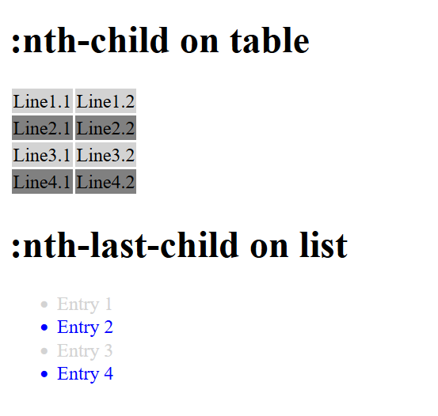
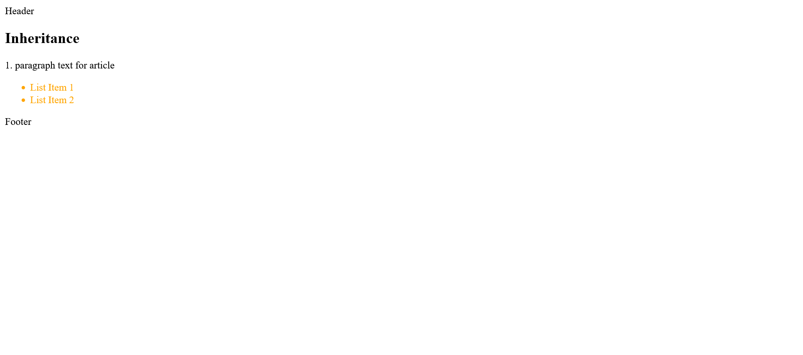

# CSS Guide
 
 Detailed guide about CSS (all basics for CSS) + templates.

 The code examples in the guide can be found in the listed folders.

-----------------------------------------------------------------------------------------

## Contents
1. Introduction to CSS
    - 1.1. History of CSS 
    - 1.2. Principle of CSS application
    - 1.3. Embedding CSS into HTML
    - 1.4. Analyze CSS in the web browser
2. The CSS selectors
    - 2.1. The simple selectors of CSS
    - 2.2. Combinators
3. Inheritance and the cascade 
    - 3.1 The principle of inheritance in CSS
    - 3.2. Understanding the control system of the cascade
    - 3.3. Pass values to CSS properties
4. The box model of CSS 
    - 4.1. The classic box model
    - 4.2. The newer alternative box model of CSS
    - 4.3. Design boxes
    - 4.4. CSS Vendor Prefixes
5. CSS positioning
    - 5.1. Positioning with the CSS property `position`
    - 5.2. Stacking with `z-index`
    - 5.3. Floating boxes with `float`
    - 5.4. Flexible boxes (flexbox model)


--------------------------------------------------------------------------------------------

# 1. Introduction to CSS
 The main task of CSS (stylesheets) is the presentation when creating web pages. CSS is used to create rules on how the content of an HTML element should be displayed. CSS supports the separation of structure and design of a document. 
 - HTML defines the semantics of the content
 - CSS defines the presentation of the content

From this point on, knowledge of HTML should be available. If there is no knowledge of HTML yet: [HTML Guide](https://github.com/BellaMrx/HTML_Guide) - Detailed guide about HTML5 (all basics for HTML) + templates


## 1.1. History of CSS
 The inventors of CSS are Hakon Wium Lie and Bert Bos. CSS Level 1 Recommendation was published in 1996, the version was mainly about the design of Wch Fonts and Color.
 The next version, CSS Level 2, was published in 1998. Since there were many inconsistencies, because different web browsers do not implement many things correctly, this version was revised in 2002. It took until 2011 for CSS 2.1.to be released. In this version, the positioning of elements was included.
 The third version of CSS, has been in the works since 2000, there was no longer a single specification used, but the various features were with CSS3 aufgeilt into modules. Each module adds new capabilities and extends CSS 2.1, keeping everything backward compatible.
 Today, CSS no longer has a version number and consists of numerous modules. CSS3 is actually just a term for the modules added after 2.1.. However, the individual modules still have version numbers. 

 An overview of all modules in progress, can be found at [W3C:CSS current work](https://www.w3.org/Style/CSS/current-work.en.html).
 All other modules can be found at [W3C:CSS Snapshot 2022](http://w3.org/TR/CSS/).


## 1.2. Principle of CSS application
 In CSS, rules for the individual HTML elements determine the appearance. It is not important at this point to understand what is written in *style.css*.
 
 example --> *1_Introduction/Part_1/index.html*

   ```
    <header>
        <h1>My CSS blog</h1>
        <p>A blog with tips about CSS ...</p>
    </header>
    <nav>
        <p> 
            <a href="#">Blog</a> | <a href="#">Tips</a> |
            <a href="#">About me</a> | <a href="#">Legal notice</a>
        </p>
    </nav>
    <main>
    <article>
        <h2>CSS Tips</h2>
        <p>Daily articles about CSS and all things related to web design and development...</p>
        <h3>More tips</h3>
        <ul>
            <li><a href="#">Hover effects</a></li>
            <li><a href="#">Center a div</a></li>
        </ul>
    </article>
    </main>
    <footer>
        <hr>
        <p> 
            <a href="#">Contact</a> | <a href="#">FAQ</a> |
            <a href="#">About me</a> | <a href="#">Legal notice</a>
        </p>
    </footer>
   ```

  example --> *1_Introduction/Part_1/style.css*

   ```
    body { 
     margin:0px; 
    }

    h1 { 
     font-family: "Verdana", "Geneva";
     font-size: 200%;
     text-align: center;
    }

    h2 { 
     font-family: "Verdana", "Geneva";
     background: #dd95cd;
     padding: 10px;
	 text-align: center;
    }

    h3 { 
     font-family: "Verdana", "Geneva"; 
     margin-left: 20px;
    }

    header { 
     background: #dd95cd;
     padding: 2px;
     text-align:center;
    }

    nav, footer { text-align: center;  }

    p { font-family: "Verdana", "Geneva"; }

    li { font-family: "Verdana", "Geneva"; }

    article p { margin: 20px; }

    article ul { margin: 20px; }

    hr { color: #dd95cd;}
   ```
  


### Structure of a CSS rule
 A CSS rule is defined with a selector and the declarations it contains. Selectors are an essential building block of CSS, of which there are many different types.
 - **Selector**: Specifies the HTML element to which the CSS rule should be applied. It is possible to apply a rule to multiple HTML elements.

   ```
    h1, h2, h3, p { color: red;}
   ```
 This specifies that the font color is red, but only for the HTML elements h1, h2, h3 and p.

 - **Declaration**: Declarations are used to format the selected HTML elements. The declaration consists of two parts, the *property* and a *value*.

 


### The declaration of a selector
 The declaration inside the braces consists of at least one property and one value. E.g. with `font-family` the font is selected, with color the font color. The order of the statements can be arbitrary.

 - **Property**: This specifies the CSS property (e.g. color, font, alignment) to be changed for the HTML element selected with the selector. CSS has many properties. More about that later.
 - **Value**: This specifies the value for the CSS property used. This value depends on the property used, e.g. if the property is `color`, the value of a color (e.g. red) can be specified.

   ```
    h1 { 
     font-family: "Arial";
     color: red;
     text-align: center;
    }
   ```


### Use comments for CSS code
 If a lot of CSS code is used, comments should be applied in the code to be able to understand what it is later.
 A comment in the CSS is displayed like this:

   ```
    /* creates a circle */
    .circle { 
     height: 50px; 
     width: 50px;
     border-radius: 50px;
    }

    /* ----------------- */
    /* header and footer */
    /* ----------------- */
    ...
   ```


## 1.3. Embedding CSS into HTML
There are three ways to include CSS in an HTML document:
- **inline style**: The CSS code is applied directly to the HTML element. 
- **internal style sheet**: The style statements are collected in the header of the HTML document.
- **external style sheet**: The CSS code is created in a CSS file and linked to the HTML document.

**inline style**
- This method is not very advantageous, because the HTML document becomes quickly confusing, and each change must be made individually, which is very time-consuming. However, if only a single property is to be changed that only applies to this element, then this method can be used for testing or demonstration purposes.

 example --> *1_Introduction/Part_2/index.html*

   ```
    <h2 style="font-family: Verdana; background: blue; padding: 2px; text-align: center;">CSS Tips</h2>
    <p style="font-family: Verdana;">Daily articles about CSS and all things related to web design and development...</p>
    <h3 style="font-family: Verdana; margin-left: 20px;">More tips</h3>
   ```

**internal style sheet**
- With this method, the CSS instructions are specified in the header of the HTML document between `<style> ... </style>` are specified. These apply to the gaze HTML document. For learning CSS it is advantageous, because you have everything in one file. But if a style is applied to multiple web pages and changed later, each page must be changed individually.
 
 example --> *1_Introduction/Part_3/index.html*

   ```
    <head>
        <title>My CSS blog</title>
        <meta charset="UTF-8" />
        <style>
            body {
                margin: 0px;
            }
        
            h1 {
                font-family: "Verdana", "Geneva";
                font-size: 200%;
                text-align: center;
            }
        
            h2 {
            font-family: "Verdana", "Geneva";
            background: #add8e6;
            padding: 2px;
            text-align: center;
            }      
        </style>
    </head>
   ```

**external style sheet**
- This method is best suited for large web pages. HTML and CSS are saved in separate files. This is the only way to ensure that the layout is consistent for each page of a large web project. The CSS file is included in the link element in the header.
 
 example --> *1_Introduction/Part_4/index.html*

   ```
    <head>
        <title>My CSS blog</title>
        <meta charset="UTF-8" />
        <link rel="stylesheet" href="style.css" />
    </head>

    <body>
        <header>
            <h1>My CSS blog</h1>
            <p>A blog with tips about CSS ...</p>
        </header>
        <nav>
            <p>
                <a href="#">Blog</a> | <a href="#">Tips</a> |
                <a href="#">About me</a> | <a href="#">Legal notice</a>
            </p>
        </nav>
        <main>
            <article>
                <h2>CSS Tips</h2>
                <p>
                Daily articles about CSS and all things related to web design and development...
                </p>
                <h3>More tips</h3>
                <ul>
                    <li><a href="#">Hover effects</a></li>
                    <li><a href="#">Center a div</a></li>
                </ul>
            </article>
        </main>
        <footer>
            <hr />
            <p>
                <a href="#">Contact</a> | <a href="#">FAQ</a> |
                <a href="#">About me</a> | <a href="#">Legal notice</a>
            </p>
        </footer>
    </body>
   ```
 
 example --> *1_Introduction/Part_4/style.css*

   ```
    h1 { 
        font-family: "Verdana", "Geneva";
        font-size: 200%;
        text-align: center;
    }

    h2 { 
        font-family: "Verdana", "Geneva";
        background: #add8e6;
        padding: 10px;
	    text-align: center;
    }

    h3 { 
        font-family: "Verdana", "Geneva"; 
        margin-left: 20px;
    }

    header { 
        background: #add8e6;
        padding: 2px;
        text-align:center;
    }

    nav, footer {
        text-align: center;  
    }

    p { 
        font-family: "Verdana", "Geneva"; 
    }

    li { 
        font-family: "Verdana", "Geneva"; 
    }

    article p { 
        margin: 20px; 
    }

    article ul { 
        margin: 20px; 
    }
   ```

Several methods can be used at the same time, e.g. an internal and external stylesheet. Here the rule noted last gets the preference.

 example --> *1_Introduction/Part_5/index.html*

   ```
    <head>
        <title>CSS Conflicts</title>
        <meta charset="UTF-8" />
        <link rel="stylesheet" href="style.css" />
        <style>
            p {
                text-align: center;
            }
        </style>
    </head>

    <body>
        <h1>A headline</h1>
        <p style="text-align: left">First paragraph text ...</p>
        <p>Second paragraph text ...</p>
    </body>
   ```
 
 example --> *1_Introduction/Part_5/style.css*

   ```
    p { 
        text-align:right; 
        color: grey; 
    }
   ```

Using the global title attribute, alternative stylessheets can be set up within the link or style element. This can be useful during team development to compare different styles. Or for different color schemes e.g. light and dark mode.

  example --> *1_Introduction/Part_6*

 


### Include style statements from an external CSS file with @import
The `@import` rule is noted in the HTML document header between `<style> ... </style>`. In practice, this example makes little sense, but should illustrate the use of the @import -rule. It is important that the `@import` rule is noted at the beginning, before which no CSS statement may stand.

 example --> *1_Introduction/Part_7/index.html*

   ```
    <head>
        <title>My CSS blog</title>
        <meta charset="UTF-8">
        <style>
        @import url("style.css");
        </style>
    </head>
   ```


### Media-specific stylesheets for specific output devices
If a stylesheet is to be specified for a particular output medium, this can be done with the media attribute in the link element.

This example demonstrates how to create a media-specific stylesheet for the screen and another for the printer:

 example --> *1_Introduction/Part_8/index.html*

   ```
    <head>
        <title>My CSS blog</title>
        <meta charset="UTF-8">
        <!-- <link rel="stylesheet" type="text/css" media="screen" href="style.css">
        <link rel="stylesheet" type="text/css" media="print" href="print.css"> -->
        <style>
            @import url("style.css") screen;
            @import url("print.css") print;
        </style>
    </head>
   ```

If the output device is a screen (`media="screen"`), the HTML document is formatted with *style.css*. If the output device is a printer (`media="print"`), the document is formatted with *print.css*.

| attribute      | explanation                    |
| -------------- | ------------------------------ |
|`media="all"`   | all output devices             |
|`media="print"` | printer                        |
|`media="screen"`| screen-oriented output devices |

There are other media types or device classes such as `aural, braille, embossed, handheld, projection, speech, tty, tv` these are considered obsolete since Media Queries Level 4, so their use is discouraged.


### Media-specific stylesheets with CSS
Media-specific stylesheets (media queries) play a major role in responsive web design. Responsive web design is standard today because web pages are viewed first not only on the computer but predominantly on the smartphone. For media-specific stylesheets, logical operators have been introduced (`and`,`not`), which can be used to perform queries about various media properties, such as the usable screen width or screen orientation.

   ```
    <link rel="stylesheet" media="screen and (min-width: 1080px)" href="style1080.css">
   ```
If the media has a screen and it is at least 1080 pixels wide, the CSS file *style1080.css* is included in the HTML document. 

There are other such media properties like `min-width`. More about that later.


## 1.4. Analyze CSS in the web browser
A good learning and help tool are the development tools provided by each web browser.

 

Here it is possible to examine a styled HTML element. When an element is selected e.g. header. The CSS instructions are displayed, which can then be changed there for testing purposes. This is only visual, the file remains untouched.

-------------------------------------------------------------------------------------

# 2. The CSS selectors
CSS offers many different selectors, which are divided into:
- **Simple selectors**: these include the type selector, the universal selector (*), the class selector(.class), the ID selector (#id), the attribute selector, and several pseudo-classes.
- **Combinators**: Combinators are two selectors concatenated with a > character (E > F; child selector), the plus sign (E + F; neighbor selector), a tilde character (E ~ F; sibling selector), or a space (E F; descendant selector).

If you want to know which selectors are implemented in the web browser and which ones can be used, you can do it here [CSS- Selector- Test ](http://css4-selectors.com/browser-selector-test/).


## 2.1. The simple selectors of CSS

### Type selector
Such a type selector, also called HTML element selector, addresses the HTML elements directly with the element name.

 example --> *2_CSS_Selectors/Part_1/index.html*

   ```
    <head>
        <title>Type selectors</title>
        <meta charset="UTF-8" />
        <link rel="stylesheet" href="styles/style.css" />
    </head>
    <body>
        <header>Header</header>
        <nav>Navigation</nav>
        <main>
            <h1>Type selectors</h1>
            <p>
                Such a type selector addresses the <abbr>HTML</abbr> elements directly with the element name.
            </p>
            <p>
                This rule is applied to all elements of the same type in the HTML document. It is irrelevant where in the HTML document these elements are written, to which class they belong or which identifier they have.
            </p>
        </main>
        <footer>Footer</footer>
    </body>
   ```

 example --> *2_CSS_Selectors/Part_1/styles/style.css*

   ```
    /* black frame, centered text, 5 pixel distance from top */
    header, nav, footer { 
        text-align:center;
        border: 1px solid black;
        margin-top: 5px;
    }

    /* gray text */
    h1, abbr { 
        color: gray; 
    }

    /* gray dotted frame */
    p { 
        border: 1px dotted gray; 
    }
   ```

 


### Class selector
In an HTML document there is usually more than just, for example, a `<p>` element, so that individual paragraphs can also be designed differently, classes are very useful. It is possible to assign a class to each element. A class is assigned with the global HTML attribute *class*. In CSS the class is marked with a *dot* e.g. `.note {...}`.
    
index.html
   ```
    <p class="note">A paragraph text</p>
   ```
style.css
   ```
    .note {
        color:red;
    }
   ```

It is also possible to use several classes at once.
    
 example --> *2_CSS_Selectors/Part_2/index.html*
   ```
    <body>
        <header class="head_foot">Header</header>
        <nav class="bigfont">Navigation</nav>
        <main>
            <h1>Class selector</h1>
            <p>The p element without a class</p>
            <p class="note">The p element with the class <code>note</code></p>
            <p class="note warning">
                The p element with the classes <code>note</code> and <code>warning</code>
            </p>
            <p class="warning">The p element with the class <code>warning</code>.</p>
            <p class="note bigfont">
                The p element with the classes <code>note</code> and <code>bigfont</code>
            </p>
        </main>
        <footer class="head_foot">Footer</footer>
    </body>
   ```

 example --> *2_CSS_Selectors/Part_2/styles/style.css*
   ```
    /* black frame, centered text, 5 pixel distance from top */
    header, nav, footer { 
        text-align:center;
        border: 1px solid black;
        margin-top: 5px;
        padding: 5px;
        font-family: Verdana, Arial;
    }

    /* gray text */
    h1, abbr {
        color: gray;
        font-family: Verdana, Arial;
    }

    /* font family for p elements */
    p { 
        font-family: Verdana, Arial; 
    }

    /* style for a hint */
    .note {
        margin-left: 50px;
        border-left: 10px solid green;
        padding-left: 5px;
    }

    /* style for a note as a warning */
    .warning {
        border-left: 10px solid red;
        border-top: 2px solid red;
        border-right: 10px solid red;
        border-bottom: 2px solid red;
        text-align: center;
    }

    /* font size to 140%, background color to gray */
    .headfoot {
        font-size: 140%;
        background: #f5f5f5;
    }

    /* font size to 130%  */
    .bigfont { 
        font-size: 130%; 
    }
   ```

 


### ID selector
An ID is assigned with the HTML attribute `id`. IDs are always unique elements in an HTML document, i.e. they may only be assigned to one element in the HTML document. Since an ID occurs only once, the id is usually preferred for div elements. In CSS the id is marked with a *#* e.g. `#main {...}`

 example --> *2_CSS_Selectors/Part_3/index.html*
   ```
    <body>
        <div id="header">Header</div>
        <div id="nav">Navigation</div>
        <div id="main">
            <h1>Class selector</h1>
            <p>The p element without a class.</p>
            <p class="note">The p element with the class <code>note</code>.</p>
            <p class="note warning">
                The p element with the classes <code>note warning</code>.
            </p>
            <p class="warning">The p element with the class <code>warning</code>.</p>
            <p class="note bigfont">
                The p element with the classes <code>note bigfont</code>.
            </p>
        </div>
        <div id="footer">Footer</div>
    </body>
   ```

 example --> *2_CSS_Selectors/Part_3/styles/style.css*
   ```
    /* black frame, centered text, 5 pixel distance from top */
    #header, #nav, #footer { 
        text-align:center;
        border: 1px solid black;
        margin-top: 5px;
        padding: 5px;
        font-family: Verdana, Arial;
    }

    /* Font size to 140%, background color to gray */
    #header, #footer {
        font-size: 140%;
        background: #f5f5f5;
    }

    #main { 
        margin: 20px; 
    }

    /* grey text */
    h1, abbr {
        color: gray;
        font-family: Verdana, Arial;
    }

    /* font family for p elements */
    p { 
        font-family: Verdana, Arial; 
    }

    /* paragraph text for a note */
    .note {
        margin-left: 50px;
        border-left: 10px solid green;
        padding-left: 5px;
    }

    /* paragraph text for a note as a warning */
    .warning {
        border-left: 10px solid red;
        border-top: 2px solid red;
        border-right: 10px solid red;
        border-bottom: 2px solid red;
        text-align: center;
    }   

    /* font size to 130% */
    .bigfont { 
        font-size: 130%; 
    }
   ```

 


In practice, class selectors should be preferred for specific properties or groups such as notes, warnings, error messages. The ID selector should be used to note individual or unique areas of a web page. 
Meaningful class names and ID names should be assigned. A meaningful name should describe the function and not the formatting (e.g. `.redBorder` = bad name, `.warning` = good name). Only upper and lower case letters, numbers, hyphens and underscores may be used for the name of the selector. The name must also not start with a digit.


### Universal selector
The universal selector is used to select all HTML elements in the HTML document. The universal selector is marked with the asterisk `*`.

 example --> *2_CSS_Selectors/Part_4/index.html*
   ```
    <body>
        <header>Header</header>
        <nav>Navigation</nav>
        <main>
            <h1>Universal selector</h1>
            <p>A single paragraph text</p>
            <p>A second paragraph text</p>
        </main>
        <footer>Footer</footer>
    </body>
   ```

 example --> *2_CSS_Selectors/Part_4/styles/style.css*
   ```
    /* black frame for all elements */

    * {
        margin: 5px;
        padding: 3px;
        border: 1px dotted black;
        text-align: center;
    }

    /* thicker border around the main element */
    /* main { border: 2px solid black; } */
    /* Thicker border around all HTML elements inside the main element */
    /* main * { border: 2px solid black; } */
   ```

 


### Attribute selector
The attribute selector is used to select HTML elements according to their HTML attributes. This is the possibility to check the presence of an attribute.

 example --> *2_CSS_Selectors/Part_5/index.html*
   ```
    <h1>Attribute selector</h1>
    <p>
      Here you can find my GitHub profile
        <a href="https://github.com/BellaMrx" title="BellaMrx GitHub Profile">BellaMrx</a>
    </p>
    <p title="A paragraph with title">
      This paragraph also has a title attribute.
    </p>
   ```

 example --> *2_CSS_Selectors/Part_5/styles/style.css*
   ```
    a[title] {
        text-decoration: none;
        color: gray;
        font-weight: bold;
    }
   ```

 


### Attribute selector for attributes with a specific attribute value
There are 3 possibilities:
- `[attributname=attributevalue]`
- `[attributname~=attributevalue]`
- `[attributname|=attributevalue]`

 example --> *2_CSS_Selectors/Part_6/index.html*
   ```
    <body>
        <h1>[title=deprecated]</h1>
        <p>
        The HTML element <code title="deprecated">center</code> was declared deprecated in HTML5 and should be implemented by a CSS solution such as
        <code>text-align: center;</code>.
        </p>
        <h1>[title~=CSS-Guide]</h1>
        <ul>
            <li>
                <a href="https://github.com/BellaMrx/CSS_Guide" title="GitHub Website BellaMrx CSS-Guide">CSS-Guide</a>
            </li>
        </ul>
        <h1>[hreflang|=en]</h1>
        <ul>
            <li>
                <a href="https://www.w3schools.com/css/css_attribute_selectors.asp" hreflang="en">W3Schools</a>
            </li>
        </ul>
    </body>
   ```

 example --> *2_CSS_Selectors/Part_6/styles/style.css*
   ```
    /* Styling for all HTML elements where title
    has the attribute value deprecated */
    [title=deprecated] {
         color: red;
        text-decoration: line-through;
    }

    /* Styling HTML elements where title contains the word
    attribute value contains the word "CSS-Guide". */
    [title~=CSS-Guide] { 
        font-weight: bold; 
    }

    /* Styling HTML elements where hreflang
    begins with the attribute value en, followed by a hyphen */
    [hreflang|=en] { 
        font-weight: bold; 
    }
   ```

 


### CSS pseudo-classes
CSS pseudo-classes are selectors for specific properties.
- Pseudo-classes for visited and non-visited hyperlinks

 example --> *2_CSS_Selectors/Part_7/index.html*
   ```
    <body>
        <h1>:link and :visited</h1>
        <ul>
            <li><a href="https://www.google.com/">Google</a></li>
            <li><a href="https://www.w3schools.com/">w3school</a></li>
            <li><a href="https://www.freecodecamp.org/">freeCodeCamp</a></li>
        </ul>
        <article class="articlestyle">
            <h2>:any-link</h2>
            <p>A simple <a href="https://github.com/BellaMrx">link</a>.</p>
        </article>
    </body>
   ```

 example --> *2_CSS_Selectors/Part_7/styles/style.css*
   ```
    a:link { 
        color: red; 
    }
    a:visited { 
        color: green; 
    }
    .articlestyle a:any-link { 
        color: grey; 
    }
    /* Chrome and Opera */
    .articlestyle a:-webkit-any-link { 
        color: grey; 
    }
   ```

 
 


- Pseudo classes for user interactions with mouse and keyboard

 example --> *2_CSS_Selectors/Part_8/index.html*
   ```
    <body>
        <h1>:hover and :focus</h1>
        <ul>
            <li><a href="https://www.google.com/">Google</a></li>
            <li><a href="https://www.w3schools.com/">w3school</a></li>
            <li><a href="https://www.freecodecamp.org/">freeCodeCamp</a></li>
        </ul>
        <h2>:focus</h2>
        <form>
            Your name:
            <input type="text" name="name" id="name" placeholder="Your name" />
        </form>
    </body>
   ```

 example --> *2_CSS_Selectors/Part_8/styles/style.css*
   ```
    input { 
        background-color: lightgray; 
    }
    input:focus { 
        background-color: white; 
    }
    input:hover { 
        box-shadow: 0 0 3px blue;  
    } 
    input:placeholder-shown {
        color: white;
    }
    li { 
        background-color: lightgray; 
    }
    li:hover { 
        background-color: snow; 
    }
    li:active { 
        background-color: gray; 
    }
    a:link { 
        text-decoration: none; color: blue; 
    }
    a:hover { 
        font-weight: bold; 
    }
    a:active { 
        color: red; 
    }
   ```

 
 
 


- Pseudo class for reference targets

 example --> *2_CSS_Selectors/Part_9/index.html*
   ```
    <body>
        <h1>:target</h1>
        <ul>
            <li><a href="#target01">Target nr. 1</a></li>
            <li><a href="#target02">Target nr. 2</a></li>
            <li><a href="#target03">Target nr. 3</a></li>
            <li><a href="#fade_in">Show hint</a></li>
        </ul>
        <div id="fade_in">Important notice!!!</div>
        <h2 id="target01">Target nr. 1</h2>
        <p>
            Lorem ipsum dolor sit amet, consectetuer adipiscing elit. Aenean commodo ligula eget dolor.
        </p>
        <h2><a id="target02">Target nr. 2</a></h2>
        <p>
            Lorem ipsum dolor sit amet, consectetuer adipiscing elit. Aenean commodo ligula eget dolor.
        </p>
        <p id="target03">
            Target nr. 3: Lorem ipsum dolor sit amet, consectetuer adipiscing elit. Aenean commodo ligula eget dolor.
        </p>
    </body>
   ```

 example --> *2_CSS_Selectors/Part_9/styles/style.css*
   ```
    :target { 
        background: lightgrey; 
    }
    div#fade_in { 
        display: none; 
    }
    div#fade_in:target { 
        display: block; 
    }
   ```

 
 
 
 
 


### CSS structure pseudo-classes
Structure pseudo-classes can be used to select elements based on their position in the document structure.

- CSS structure pseudo-classes with `:root` and `:empty`

 example --> *2_CSS_Selectors/Part_10/index.html*
   ```
    <body>
        <h1>:root and :empty</h1>
        <p>
            Lorem ipsum dolor sit amet, consectetuer adipiscing elit. Aenean commodo ligula eget dolor.
        </p>
        <p></p>
        <h2>:empty on table</h2>
        <table>
            <tbody>
                <tr>
                    <td>Value</td>
                    <td></td>
                </tr>
                <tr>
                    <td></td>
                    <td>Value</td>
                </tr>
                <tr>
                    <td></td>
                    <td></td>
                </tr>
            </tbody>
        </table>
    </body>
   ```

 example --> *2_CSS_Selectors/Part_10/styles/style.css*
   ```
    :root { 
        color: lightgrey; 
    }

    :empty { 
        background-color: yellow; padding: 10px; 
    }

    td:empty { 
        background-color: green; 
    }
   ```

 


- Structure pseudo-classes for child elements

 example --> *2_CSS_Selectors/Part_11/index.html*
   ```
    <body>
        <h1>:first-child in body</h1>
        <p>
            Lorem ipsum dolor sit amet, consectetuer adipiscing elit. Aenean commodo ligula eget dolor.
        </p>
        <h2>:first-child and :last-child on table</h2>
        <table>
            <tbody>
                <tr>
                    <td>:first-child in tr</td>
                    <td>Text only</td>
                    <td>:last-child in tr</td>
                </tr>
                <tr>
                    <td>:first-child in tr</td>
                    <td>Text only</td>
                    <td>:last-child in tr</td>
                </tr>
            </tbody>
        </table>
        <ul>
            <li>This is selected by :first-child in ul.</li>
            <li>This is not selected.</li>
            <li>This is not selected.</li>
            <li>This is selected by :last-child in ul.</li>
        </ul>
        <p>This one is selected by :last-child of body.</p>
    </body>
   ```

 example --> *2_CSS_Selectors/Part_11/styles/style.css*
   ```
    * { 
        background-color: white; 
    }

    body { 
        padding: 5px; 
    }

    :first-child { 
        border: 2px solid black;  
    }

    :last-child { 
        border: 2px dotted gray; 
    }
   ```

 


 example --> *2_CSS_Selectors/Part_12/index.html*
   ```
    <body>
        <h1>:nth-child on table</h1>
        <table>
            <tbody>
                <tr>
                    <td>Line1.1</td>
                    <td>Line1.2</td>
                </tr>
                <tr>
                    <td>Line2.1</td>
                    <td>Line2.2</td>
                </tr>
                <tr>
                    <td>Line3.1</td>
                    <td>Line3.2</td>
                </tr>
                <tr>
                    <td>Line4.1</td>
                    <td>Line4.2</td>
                </tr>
            </tbody>
        </table>
        <h1>:nth-last-child on list</h1>
        <ul>
            <li>Entry 1</li>
            <li>Entry 2</li>
            <li>Entry 3</li>
            <li>Entry 4</li>
        </ul>
    </body>
   ```

 example --> *2_CSS_Selectors/Part_12/styles/style.css*
   ```
    tr:nth-child(odd) { 
        background: lightgray; 
    }

    tr:nth-child(even) { 
        background: grey; 
    }

    li:nth-last-child(odd) { 
        color: blue; 
    }

    li:nth-last-child(even) { 
        color: lightgray; 
    }
   ```

 


- Structure pseudo-classes for certain child elements

 example --> *2_CSS_Selectors/Part_13/index.html*
   ```
    <body>
        <header>Header</header>
        <article>
            <h1>Article 1</h1>
            <p>Text for article</p>
        </article>
        <article>
            <h1>Article 2</h1>
            <p>Text for article</p>
        </article>
        <article>
            <h1>Article 3</h1>
            <p>Text for article</p>
        </article>
        <footer>Footer</footer>
    </body>
   ```

 example --> *2_CSS_Selectors/Part_13/styles/style.css*
   ```
    article:first-of-type { 
        border: 2px solid black; 
    }

    article:last-of-type { 
        border: 2px dotted gray; 
    }
   ```

 


 example --> *2_CSS_Selectors/Part_14/index.html*
   ```
    <body>
        <h1>:only-of-type</h1>
        <p><em>Bear</em>! Who is this <em>Bear</em>?</p>
        <p>Attention! <em>Bear</em> could be behind <strong>you</strong>!</p>
    </body>
   ```

 example --> *2_CSS_Selectors/Part_14/styles/style.css*
   ```
    em:only-of-type { 
        font-weight: bold; 
    }
   ```

 


- Pseudo elements, the selectors for elements that do not exist

 example --> *2_CSS_Selectors/Part_15/index.html*
   ```
    <body>
        <h1>:first-letter and :first-line</h1>
        <p>
            Lorem ipsum dolor sit amet, consectetuer adipiscing elit. Aenean commodo ligula eget dolor. Aenean massa. Cum sociis natoque penatibus et magnis dis parturient montes, nascetur ridiculus mus. Donec quam felis, ultricies nec, pellentesque eu, pretium quis,
            sem. Nulla consequat massa quis enim.
        </p>
        <h1>:before and :after</h1>
        <table>
            <tbody>
                <tr>
                    <td>from A to B</td>
                    <td class="time">55</td>
                </tr>
                <tr>
                    <td>from A to C</td>
                    <td class="time">35</td>
                </tr>
                <tr>
                    <td>from B to C</td>
                    <td class="time">20</td>
                </tr>
            </tbody>
        </table>
    </body>
   ```

 example --> *2_CSS_Selectors/Part_15/styles/style.css*
   ```
    p::first-line { 
        font-weight: bold; 
    }

    p::first-letter{ 
        font-size: xx-large; float: left; 
    }

    h1::-moz-selection { 
        background-color: orange; color:red; 
    }

    td.time::before { 
        content: "approx. "; 
    }

    td.time::after { 
        content: " Minutes";    
    }
   ```

 


## 2.2. Combinators
A combiner is a character between two selectors that concatenates these selectors. The first selector forms the condition and the second selector forms the target to be selected if the condition is true.

| Combinator | Designation                 | Meaning                                             |
| ---------- | --------------------------- | --------------------------------------------------- |
| E,F        | descendant combinator       | F is selected if it is a descendant of an E element |
| E > F      | child combinator            | F is selected only if it is a direct descendant of an E element |
| E + F      | adjacent sibling combinator | F is only selected if it occurs directly after E (in the same parent element) |
| E ~ F      | general sibling combinator  | F is selected only if occurs after E (in the same parent element) |

- Descendant selector (E, F)

 example --> *2_CSS_Selectors/Part_16/index.html*
   ```
    <body>
        <header>Header</header>
        <article>
            <h1>Descendant combiner (E1 E2)</h1>
            <p>1. paragraph text for article</p>
            <ul>
                <li>List item 1</li>
                <li>List item 2</li>
                <li>
                    <p>A paragraph text in the list item</p>
                </li>
            </ul>
            <p>2. paragraph text for article</p>
        </article>
        <p>1. paragraph text after the article</p>
        <p>2. paragraph text after the article</p>
        <footer>Footer</footer>
    </body>
   ```

 example --> *2_CSS_Selectors/Part_16/styles/style.css*
   ```
    article p { 
        background: lightblue; 
    }
   ```

 


- Child selector (E1 > E2)

 example --> *2_CSS_Selectors/Part_17/index.html*
   ```
    <body>
        <header>Header</header>
        <article>
            <h1>Child Combinator (E1 &gt; E2)</h1>
            <p>1. paragraph text for article</p>
            <ul>
                <li>List item 1</li>
                <li>List item 2</li>
                <li>
                    <p>A paragraph text in the list item</p>
                </li>
            </ul>
            <p>2. paragraph text for article</p>
        </article>
        <p>1. paragraph text after the article</p>
        <p>2. paragraph text after the article</p>
        <footer>Footer</footer>
    </body>
   ```

 example --> *2_CSS_Selectors/Part_17/styles/style.css*
   ```
    article > p { 
        background: lightblue; 
    }
   ```

 


- Neighbor selector (E1 + E2)

 example --> *2_CSS_Selectors/Part_18/index.html*
   ```
    <body>
        <header>Header</header>
        <article>
            <h1>Direct adjacent combiner (E1 + E2)</h1>
            <p>1. paragraph text for article</p>
            <ul>
                <li>List item 1</li>
                <li>List item 2</li>
                <li>
                    <p>A paragraph text in the list item</p>
                </li>
            </ul>
            <p>2. paragraph text for article</p>
        </article>
        <p>1. paragraph text after the article</p>
        <p>2. paragraph text after the article</p>
        <footer>Footer</footer>
    </body>
   ```

 example --> *2_CSS_Selectors/Part_18/styles/style.css*
   ```
    article + p { 
        background: lightblue; 
    }
   ```

 


- Sibling selector (E1 ~ E2)

 example --> *2_CSS_Selectors/Part_19/index.html*
   ```
    <body>
        <header>Header</header>
        <article>
            <h1>Indirect adjacent combiner (E1 ~ E2)</h1>
            <p>1. paragraph text for article</p>
            <ul>
                <li>List item 1</li>
                <li>List item 2</li>
                <li>
                    <p>A paragraph text in the list item</p>
                </li>
            </ul>
            <p>2. paragraph text for article</p>
        </article>
        <p>1. paragraph text after the article</p>
        <p>2. paragraph text after the article</p>
        <footer>Footer</footer>
    </body>
   ```

 example --> *2_CSS_Selectors/Part_19/styles/style.css*
   ```
    article ~ p { 
        background: lightblue; 
    }
   ```

 


 ----------------------------------------------------------------------

# 3. Inheritance and the cascade 

## 3.1 The principle of inheritance in CSS
An important principle in CSS is inheritance. Only this makes it possible to define different CSS properties such as colors, font and font size once in a central place instead of having to repeat them all the time.
The various HTML elements have ancestors and descendants (parent and child elements). Because of these relationships, the subsequent child elements inherit many style properties from the higher-level parent elements. 

 example --> *3_Inheritance_Cascade/Part_1/index.html*
   ```
    <body>
        <header>Header</header>
        <article>
            <h1>Inheritance</h1>
            <p>1. paragraph text for article</p>
            <ul>
                <li>List item 1</li>
                <li>List item 2</li>
                <li>List item 3</li>
            </ul>
            <p>2. paragraph text for article</p>
        </article>
        <p>1. paragraph text after the article</p>
        <p>2. paragraph text after the article</p>
        <footer>Footer</footer>
    </body>
   ```
The body element here contains a header, article, two p and a footer element as direct descendants. This makes the body element the parent element of all these elements. Direct descendants of the article element are the h1, p, and ul elements. These direct descendants of article are the indirect descendants of the body element. Starting from the body element, the set CSS properties are inherited from element to element.

 example --> *3_Inheritance_Cascade/Part_1/styles/style.css*
   ```
    body {
        background: gray;
        font-family: Arial, Verdana;
        color: white;
    }

    article {
        background: lightblue;
        color: black;
    }
   ```
If, as in this example with the article selector, a new inheritable CSS property is assigned to an element, such as the text color here, the element specified with the selector (here article) and its descendants no longer inherit the CSS property of the parent element. In that case, the CSS properties declared in the selector to the descendants of an article element now become a black text color. The font-family of the body selector, on the other hand, was not declared in the article type selector, so the font-family declared in the body selector (here Arial) is still passed on to article and its descendants. background is not passed on to the descendants by the article selector, but is transparent, since that is the default value in CSS.

 

If no specific value has been assigned to a CSS property, then the web browser uses the default value set for it when it inherits.
If these inheritances did not exist, a CSS rule would have to be explicitly created for each element. Inheritance can help write an efficient and well-organized stylesheet. For example, it is often sufficient to specify the font and other CSS properties early in the body element.

### Caution when using relative properties
Inheriting relative units such as font size with percentages or em can result in surprising changes, because some web browsers reapply this value for each element if the font size is also defined with percentages or em for further elements. Because it is not the value defined in the stylesheet that is passed on, but the value calculated by the web browser.

### Not everything is inherited
Not all CSS properties are passed on to the descendants. Especially CSS properties like `margin`, `padding`, `border` or `width` would not make much sense.
The following are not inherited: `background`, `border`, `width`, `height`, `padding`, `margin`, `position`, `top`, `right`, `bottom`, `left`, `float`, `clear`

### Force inheritance with `inherit` 
Some CSS properties are not inherited, but it is possible to force that with `inherit`.

 example --> *3_Inheritance_Cascade/Part_2/index.html*
   ```
    <body>
        <header>Header</header>
        <article>
            <h1>Inheritance</h1>
            <p>1. paragraph text for article</p>
            <ul>
                <li>List item 1</li>
                <li>List item 2</li>
                <li>List item 3</li>
            </ul>
            <p>2. paragraph text for article</p>
        </article>
        <p>1. paragraph text after the article</p>
        <p>2. paragraph text after the article</p>
        <footer>Footer</footer>
    </body>
   ```

 example --> *3_Inheritance_Cascade/Part_2/styles/style.css*
   ```
    body {
        font-family: Arial, Verdana;
        color: white;
        background: gray;
    }

    article {
        border: 4px dotted black;
        background: lightblue;
        color: black;
    }

    p {
        border: inherit;
        background: lightgray;
    }
   ```

 

### Restore the default value of a CSS property with `initial`

 example --> *3_Inheritance_Cascade/Part_3/index.html*
   ```
    <body>
        <header>Header</header>
        <article>
            <h1>Inheritance</h1>
            <p>1. paragraph text for article</p>
            <ul>
                <li>List item 1</li>
                <li>List item 2</li>
                <li>List item 3</li>
            </ul>
            <p>2. paragraph text for article</p>
        </article>
        <p>1. paragraph text after the article</p>
        <p>2. paragraph text after the article</p>
        <footer>Footer</footer>
    </body>
   ```

 example --> *3_Inheritance_Cascade/Part_3/styles/style.css*
   ```
    body {
        font-family: Arial, Verdana;
        color: white;
        background: gray;
    }

    article {
        border: 4px dotted black;
        background: lightblue;
        color: black;
    }

    p {
        border: inherit;
        background: unset;
        color: initial;
    }
   ```

With `color:initial;` the font color of all p elements in the HTML document is reset to the default value of the browser.

 


### Force inheritance or restore value with `unset`
The `unset` keyword is a middle ground between `inherit` and `initial`. When the keyword is used for a CSS property, it behaves like `inherit` and inherits the value for the corresponding CSS property of the parent element. If there is no parent element with a set value for that CSS property, `unset` behaves like `initial` and resets a CSS property to the default value provided by the CSS specification.


### Force inherit or restore values for all properties
With the shorthand notation `all`, all CSS properties of the parent element can be inherited with `inherit` or reset to default with `initial`. `unset` can also be used with `all`.

 example --> *3_Inheritance_Cascade/Part_4/index.html*
   ```
    <body>
        <header>Header</header>
        <article>
            <h1>Inheritance</h1>
            <p>1. paragraph text for article</p>
            <ul>
                <li>List item 1</li>
                <li>List item 2</li>
                <li>List item 3</li>
            </ul>
            <p>2. paragraph text for article</p>
        </article>
        <p>1. paragraph text after the article</p>
        <p class="p_outside">2. paragraph text after the article</p>
        <footer>Footer</footer>
    </body>
   ```

 example --> *3_Inheritance_Cascade/Part_4/styles/style.css*
   ```
    body {
        font-family: Arial, Verdana;
        color: white;
        background: gray;
    }

    article {
        border: 4px dotted black;
        background: lightblue;
        color: black;
    }

    p {
	    border: inherit;
	    background: lightgray;
	    color: unset;
    }

    .p_outside {
        all: initial; 
        display: block;
        margin: 5px;
        color: silver;
    }
   ```

 


## 3.2. Understanding the control system of the cascade
Cascade means that a document can be formatted not only by one stylesheet, but from a multitude of stylesheets that can come from different sources. This makes it possible for one stylesheet to build on another, saving a lot of work. Due to the multiple ways in which stylesheet statements can be included and combined with each other, conflicts and contradictions can come up. Such a conflict arises when the same CSS property has been assigned different values in several statements. For such cases, there is a rule system that decides which of the conflicting or competing style statements will ultimately be applied to an element.

### The origin of a stylesheet
- **Browser stylesheet**: The default stylesheet of the web browser is used if no CSS formatting is assigned to the HTML document. Each web browser provides basic formatting for this purpose. Each web browser provides its own default setting, so there are usually slight differences.

- **User stylesheet**: Some web browsers offer the user directly or via extensions to include own stylesheet files. When custom stylesheets are included, the corresponding properties of the web browser are overridden.

- **Author stylesheet**: This is the stylesheet you created and referenced or included with the @import rule, which is usually used to override or combine various CSS properties of the browser stylesheet and, if applicable, the user stylesheet.

Of these three sources, the browser stylesheet has the lowest priority. If a user stylesheet (medium priority) is used, the browser stylesheet is overwritten. The author stylesheet has the highest priority and overwrites all others.


### Increase the priority of a CSS property with `!important`
If a CSS rule or CSS property is declared multiple times in the same file, the last declared property usually becomes active.

 example --> *3_Inheritance_Cascade/Part_5/index.html*
   ```
    <body>
        <header>Header</header>
        <article class="priority">
            <h1>without !important</h1>
            <p>1. paragraph text for article</p>
            <ul>
                <li>List item 1</li>
                <li>List item 2</li>
                <li>List item 3</li>
            </ul>
            <p>2. paragraph text for article</p>
        </article>
        <p>1. paragraph text after the article</p>
        <p>2. paragraph text after the article</p>
        <footer>Footer</footer>
    </body>
   ```

 example --> *3_Inheritance_Cascade/Part_5/styles/style.css*
   ```
    .priority {
        border: 2px solid red;
    }

    .priority {
        border: 2px dotted green;
    }
   ```

 


The CSS keyword `!important` can be used to increase the priority so that the property cannot be overridden by the following specifications.

 example --> *3_Inheritance_Cascade/Part_6/index.html*
   ```
    <body>
        <header>Header</header>
        <article class="priority">
            <h1>with !important</h1>
            <p>1. paragraph text for article</p>
            <ul>
                <li>List item 1</li>
                <li>List item 2</li>
                <li>List item 3</li>
            </ul>
            <p>2. paragraph text for article</p>
        </article>
        <p>1. paragraph text after the article</p>
        <p>2. paragraph text after the article</p>
        <footer>Footer</footer>
    </body>
   ```

 example --> *3_Inheritance_Cascade/Part_6/styles/style.css*
   ```
    .priority {
        border: 2px solid red !important;
    }

    .priority {
        border: 2px dotted green;
    }
   ```

 


### Sorting by weighting of the selectors
This sorting is used when there are equivalent specifications within a stylesheet. Here, a value is calculated for each selector that indicates the weighting of the selector. This value is called specificity. This specificity is expressed as a numerical value, and the higher this numerical value is, the more important the selector is, and it overwrites a competing selector with a lower value.

from highest weight(A) to lowest weight(D):
A = style attributes
B = ID
C = class, pseudo-class, attributes, 
D = pseudo elements

Universal selectors with `*` get no weighting and behave neutrally, as do combinatorial characters `>`,`+`,`~` and the space between two selectors.

 example --> *3_Inheritance_Cascade/Part_7/index.html*
   ```
    <body>
        <header>Header</header>
        <article>
            <h1>Inheritance</h1>
            <p>1. paragraph text for article</p>
            <ul id="index">
                <li class="aclass">List Item 1</li>
                <li class="aclass">List Item 2</li>
            </ul>
        </article>
        <footer>Footer</footer>
    </body>
   ```

 example --> *3_Inheritance_Cascade/Part_7/styles/style.css*
   ```
    .aclass { 
        color: green; 
    }

    #index li.aclass { 
        color: orange; 
    }

    li { 
        color: red; 
    }

    li.aclass { 
        color: blue; 
    }

    body article ul li { 
        color: yellow; 
    }

    #index li { 
        color: gray; 
    }
   ```

 


### Analyzing the cascade in the browser
Many web browsers offer developer tools that are a great help. There you can easily see which CSS properties were inherited from the web browser (USER AGENT STYLESHEET) and which were inherited from other elements (INHERITED FROM). Crossed out elements were overwritten by another element.

 


## 3.3. Pass values to CSS properties
Only the most common types will be discussed here. More information about CSS values can be found at [w3](https://www.w3.org/TR/css-values-3/).


### The different units of measurement in CSS
The specifications of numerical values, e.g. font sizes, heights and widths or distances, are noted directly after the value. In CSS, there are many units of measurement that can be used either as relative or absolute specifications. For the number 0, the unit of measurement does not have to be specified.

   ```
    font-size: 14pt;
    margin: 1em;
    width: 100%;
    border: 3px ...;
   ```

The numeric values in CSS can be integers or floating point numbers. The comma is represented by a dot in CSS. e.g. `font-size: 1.2em;`. Some values in CSS do not require units of measurement, e.g. `z-index: 1;` or `opacity: 0.5;`. Negative values can also be used as long as it makes sense e.g. `z-index: -2;` , but negative values cannot be used for length specifications like height or width.

| unit of measurement | CSS name | specification      | description                           |
| ------------------- | -------- | ------------------ |-------------------------------------- |
| pixel               | px       | absolute, relative | The display of pixels depends on the pixel density of the output device. At a high screen resolution, the pixels become smaller, which is why the display appears smaller. Pixels are thus a relative unit of measurement on display devices and an absolute unit of measurement in relation to the content. |
| point               | pt       | absolute           | This is a typographic unit of measure, and 1 point is equal to 1/72 inch e.g. `font-size: 12pt;`  |
| pica                | pc       | absolute           | Pica is a typographic unit of measurement, one pica is 1/6 inch and therefore equals 12 points e.g `font-size: 1pc;` or 12pt |
| centimeter          | cm       | absolute           | A centimeter is the hundredth part of a meter and corresponds to 10 mm e.g. `margin: 1.2cm;` |
| millimeter          | mm       | absolute           | A millimeter is one thousandth of a meter e.g. `padding: 3mm;` |
| inch                | in       | absolute           | 1 inch equals 2.54 cm e.g. `margin-top: 1in;` |
| square width        | em       | relative           | An em stands for the font size of the element. If em is used for the font size itself, then this value refers to the font size of the parent element e.g. `font-size: 1.3em;` |
| x-height            | ex       | relative           | An ex represents the height of the lowercase x of the font used in this element. Again, if ex is used for the font size, then this height refers to the value of x in the parent element. |
| percent             | %        | relative           | The percentage is very flexible. It depends on the CSS property whether this value refers to the element's own size, to that of the parent element, or to a general context. |
| root em             | rem      | relative           | The rem initially behaves in the same way as em, except that the rem value is based on the root element and not on the font size of the respective parent element. In HTML the root element is the body or html element e.g. `font-size: 1.2.rem;` |
| viewport width      | vw       | relative           | 1vw corresponds to 1% or the hundredth part of the width of the display area. Thus, 100vw is equal to the complete width of the display area. This unit of measurement can be used to adjust the font size to the display area of the device or the size of the browser window. |
| viewport height     | vh       | relative           | 1vh corresponds to 1% or the hundredth part of the height of the display area. Therefore, 100vh is equal to the entire height of the display area. This unit of measurement can be used to adjust the font size to the display area of the device or the size of the browser window. |


### Strings and keywords as value for CSS properties
CSS makes a strict distinction between keywords and strings.

Strings are placed between single or double quotes in CSS:
- content: " meter";
- content: '$ ';

The keywords in CSS are not marked separately:
- color: white;
- width: auto;
- display: inline-block;


### Use color in CSS
An important design element in CSS are colors. There are several ways to specify color values in CSS. None of these different color specifications have advantages or disadvantages when displayed on the web page.

#### **use a name as color value**
From the beginning it was possible in CSS to note color values directly with names.

   ```
    section {
        background-color: gray;
        color: blue;
    }
   ```

A list of all color values, can be found at [147Colors](http://www.colors.commutercreative.com/).


#### **Classic hexadecimal notation for the color specification**
This notation is still one of the most commonly used for color values. The specification starts with the character #, followed by the color parts for red, green and blue in a range from 00(for 0) to FF(for 255). The general notation is #RRGGBB.

   ```
    section {
        background-color: #0000FF;      /* blue */
        color: #FFFFFF;     /* white */
    }
   ```

There is also a shorthand notation for hexadecimal values.

   ```
    section {
        background-color: #000000;      /* black */
        color: #FFFFFF;     /* white */
    }
   ```
The same but in shorthand:

   ```
    section {
        background-color: #000;      /* black */
        color: #FFF;     /* white */
    }
   ```


#### **Mix colors yourself with red, green and blue**
An RGB color mixture can be defined with CSS function rgb(red, green, blue). The specifications for red, green and blue can be made either with percentage values (0-100%) or with decimal numbers (0-255).

- decimal numbers

   ```
    section {
        background-color: rgb(0, 0, 255);      /* blue */
        color: rgb(255, 255, 255);      /* white */
    }
   ```

- percent

   ```
    section {
        background-color: rgb(0%, 0%, 100%);      /* blue */
        color: rgb(100%, 100%, 100%);      /* white */
    }
   ```


#### **RBG mix with transparency**
Another function is rgba(), this has been extended by only one value, the alpha value for transparency. This value can be used to specify the transparency of the color. The value 0.0 means complete transparency, and the value 1.0 stands for complete opacity and thus corresponds to the function rgb().
   ```
    section {
        color: rgba(255, 255, 255, 0.3)
    }
   ```

 example --> *3_Inheritance_Cascade/Part_8/index.html*
   ```
    <body>
        <h3>color: rgba(255, 255, 255, 0.5);</h3>
        <p class="p_article_1">Lorem ipsum dolor sit amet, consectetuer adipiscing elit...</p>
        <h3>color: rgb(255, 255, 255);</h3>
        <p class="p_article_2">Lorem ipsum dolor sit amet, consectetuer adipiscing elit...</p>
    </body>
   ```

 example --> *3_Inheritance_Cascade/Part_8/styles/style.css*
   ```
    .p_article_1 { 
        background-image:url('../images/sunsetTree.jpg');
        background-repeat: no-repeat;
        font-weight: bolder;
        width: 450px;
        color: rgba(255, 255, 255, 0.5);    
    } 
 
    .p_article_2 { 
        background-image:url('../images/sunsetTree.jpg');
        background-repeat: no-repeat;
        font-weight: bolder;
        width: 450px;
        color: rgb(255, 255, 255);     
    } 
   ```

 


#### **HSL Mix - mix colors with hue, saturation and lightness**
Starting at Level 3, CSS offers an HSL blend of hue, saturation, and lightness. Many web designers find it more intuitive or easier to remember to specify the hue with an integer value from 0 to 360. It's like a color wheel from 0 to 359 degrees, where the value 0 or 360 represents red, 120 represents green, and 240 represents blue.
The values of saturation and lightness are expressed as percentages. The more the value of saturation is reduced from 100% to 0%, the more the hue becomes a gray. The normal brightness, on the other hand, is indicated with the value 50%. A lightness of 100% is white and a lightness of 0% is black.
   ```
    .p_article { 
        background-color: hsl(240, 100%, 50%);      /* blue */
        color: hsl(0, 100%, 100%);      /* white font color */
    } 
   ```

As with the RGB blends, there is still an HSL blend with hsla(hue, saturation, lightness, opacity), where the opacity can be specified as a fourth parameter from 0 (completely transparent) to 1 (no transparency).

If you want to find out which color is used on a page, the browsers offer help.
Firefox for example has a color picker:

 

 

Google Chrome offers the extension ColorZilla (which is also available for Firefox). And for Microsft Edge I would use ColorFish Color Picker (if I would use it).

The browsers offer many help options, it is recommended to be familiar with the brwosers.


### Angle measures in CSS
In CSS there are also some angle measures that can be used to define a rotation. If a negative value is used, the rotation is counterclockwise.

| Unit of Measurement | CSS Name | Description |
| ------------------- | -------- | ------------------------------------------------------------- |
| degrees             | deg      | angle in degrees; 360 degrees corresponds to a complete circle e.g. tarnsform: rotate(90deg); |
| Gon                 | grad     | angle in Gon; a complete circle corresponds to 400 Gon. 100 Gon = 90 degree e.g. tarnsform: rotate( 100grad); |
| Radian              | rad      | angle in ground measure; a complete circle corresponds to 2 Pi e.g. tarnsform: rotate(5.5rad); |
| full angle          | turn     | A full angle is a circle rotation (0.25turn corresponds to a 90 degree rotation) e.g. tarnsform: rotate(0.25turn); |


### Shorthand in CSS
- margin: is used for an outer border or distance between the current element and its parent or neighboring element.

   ```
    section { 
        margin: 20px;
    } 
   ```

is the shorthand notation of:
   ```
    section { 
        margin-top: 20px;
        margin-right: 20px;
        margin-bottom: 20px;
        margin-left: 20px;
    } 
   ```

also possible:
   ```
    section { 
        margin: 20px 10px 20px 5px;     /* margin-top, margin-right, margin-bottom, margin-left */
    } 
   ```

The only important thing about this notation is that the order is clockwise (top = 12 o'clock).

If the values of left and right are equal, is also possible:
   ```
    section { 
        margin: 20px 10px 5px;     /* margin-top, margin-right and -left, margin-bottom */
    } 
   ```
By omitting the fourth value (left), the value of right is used, making the left and right spacing 10px. 

This also works with top and bottom:
   ```
    section { 
        margin: 20px 10px;     /* margin-top and -bottom, margin-right and -left */
    } 
   ```

also possible:
   ```
    section { 
        margin: 20px;     /* margin-top, margin-bottom, margin -left */
        margin-right: 0;
    } 
   ```

Besides margin, there are other CSS properties that I will discuss here later.

---------------------------------------------------------------------------------

# 4. The box model of CSS
In CSS, the box model serves as the basis for positioning elements and creating a layout.


## 4.1. The classic box model
The box model includes
- the actual **content** of text and images, which is specified with **width** and **height**
- **padding**, which creates space between the content and the border of an element
- the **border**
- **margin**, this creates space around an element, outside of paddings and borders 

 


### width and height
The actual content area with the space for text and images can be specified with the CSS properties width and height. If no value is specified, the HTML element is as wide and high as the surrounding element.

 example --> *4_Box_Model/Part_1/index.html*
   ```
    <h1>width and height</h1>
    <article class="article_01">
        <h2 class="h_2">Article 1 (width: 300px)</h2>
        <p>
            Lorem <abbr>ipsum</abbr> dolor <em>sit amet</em>, consectetuer adipiscing elit. <strong>Aenean commodo</strong> ligula eget dolor.
            <a href="#">Aenean massa</a>. Cum sociis natoque penatibus et
            <ins>magnis</ins> dis parturient montes, nascetur
            <del>ridiculus</del> mus. Donec quam felis, <mark>ultricies nec</mark>, pellentesque eu, pretium quis, sem. Nulla consequat massa quis enim.
        </p>
    </article>
    <article class="article_02">
        <h2 class="h_2">Article 2 (width: 600px)</h2>
        <p>
            Lorem <abbr>ipsum</abbr> dolor <em>sit amet</em>, consectetuer adipiscing elit. <strong>Aenean commodo</strong> ligula eget dolor.
            <a href="#">Aenean massa</a>. Cum sociis natoque penatibus et
            <ins>magnis</ins> dis parturient montes, nascetur
            <del>ridiculus</del> mus. Donec quam felis, <mark>ultricies nec</mark>, pellentesque eu, pretium quis, sem. Nulla consequat massa quis enim.
        </p>
    </article>
   ```

 example --> *4_Box_Model/Part_1/styles/style.css*
   ```
    .article_01 { 
        width: 300px; background: #e7fad7; 
    }

    .article_02 { 
        width: 600px; background: #e7fad7; 
    }

    .h_2 { 
        background: #adfd93; 
    }
   ```

 


Note that the height specification is only an initial value. If the content of the encompassing element is greater than the specified height, the content will still be displayed and will overflow the box.

 example --> *4_Box_Model/Part_2/index.html*
   ```
    <h1>height</h1>
    <article class="article_01">
        <h2>Headline</h2>
        <p>
            Lorem ipsum dolor sit amet, consectetuer adipiscing elit. Aenean commodo ligula eget dolor. Aenean massa. Cum sociis natoque penatibus et magnis dis parturient montes, nascetur ridiculus mus. Donec quam felis, ultricies nec, pellentesque eu, pretium quis,
            sem. Nulla consequat massa quis enim. Donec pede justo, fringilla vel, aliquet nec, vulputate eget, arcu. In enim justo, rhoncus ut, imperdiet a, venenatis vitae, justo.
        </p>
    </article>
   ```

 example --> *4_Box_Model/Part_2/styles/style.css*
   ```
    .article_01 {
        width: 230px;
        height: 215px;
        background-color: #e7fad7;
        border: black 1px solid;
        /* overflow: hidden; */
    }
   ```

 


If overflowing is to be prevented, this is possible with the CSS property `overflow: hidden;`, with which, however, the oversized content is no longer displayed.

 


In practice, fixed values for width and height are rarely defined. Responsive web design tends to use properties such as `min-width` or `min-height` or `max-height` to allow flexible limits suitable for the device or screen width.


### padding
The CSS property padding alone sets all four sides clockwise, which is the shorthand notation:

   ```
    section { 
        padding: 20px;
    } 
   ```

is the shorthand notation of:
   ```
    section { 
        padding-top: 20px;
        padding-right: 20px;
        padding-bottom: 20px;
        padding-left: 20px;
    } 
   ```

The shorthand notation with padding works the same as with margin.


### border
The border wraps around the inner space (padding) and has its own CSS properties for thickness, line style, and color. Again, as with margin and padding, all four sides can be adjusted separately.

 example --> *4_Box_Model/Part_3/index.html*
   ```
    <h1>border</h1>
    <article class="article01">
        <h2 class="h_2">width: 600px; border: 10px solid sienna;</h2>
        <p>
            Lorem <abbr>ipsum</abbr> dolor <em>sit amet</em>, consectetuer adipiscing elit. <strong>Aenean commodo</strong> ligula eget dolor.
            <a href="#">Aenean massa</a>. Cum sociis natoque penatibus et
            <ins>magnis</ins> dis parturient montes, nascetur
            <del>ridiculus</del> mus. Donec quam felis, <mark>ultricies nec</mark>, pellentesque eu, pretium quis, sem. Nulla consequat massa quis enim.
        </p>
    </article>
    <article class="article02">
        <h2 class="h_2">width: 600px; border: 10px solid peru; padding: 50px;</h2>
        <p>
            Lorem <abbr>ipsum</abbr> dolor <em>sit amet</em>, consectetuer adipiscing elit. <strong>Aenean commodo</strong> ligula eget dolor.
            <a href="#">Aenean massa</a>. Cum sociis natoque penatibus et
            <ins>magnis</ins> dis parturient montes, nascetur
            <del>ridiculus</del> mus. Donec quam felis, <mark>ultricies nec</mark>, pellentesque eu, pretium quis, sem. Nulla consequat massa quis enim.
        </p>
    </article>
   ```

 example --> *4_Box_Model/Part_3/styles/style.css*
   ```
    .article01 {
        width: 600px;
        border: 10px solid #56d22d;
        background-color: #e7fad7;
    }

    .article02 {
        width: 600px;
        padding: 50px;
        border: 10px solid #76ea4f;
        background-color: #e7fad7;
    }

    .h_2 { 
        background-color: #adfd93;
    }
   ```

 


### margin
The outer spacing of the box model is called margin. The outer margin has no color, is completely transparent and therefore takes on the background color of the surrounding element. Negative values are also allowed for margin. How these affect margin depends on whether the elements are static, positioned or floated.

 example --> *4_Box_Model/Part_4/index.html*
   ```
    <header class="headfoot">Header</header>
    <article class="article01">
        <h2>margin: 10px 0px;</h2>
        <p>
            Lorem <abbr>ipsum</abbr> dolor <em>sit amet</em>, consectetuer adipiscing elit. <strong>Aenean commodo</strong> ligula eget dolor.
            <a href="#">Aenean massa</a>. Cum sociis natoque penatibus et
            <ins>magnis</ins> dis parturient montes, nascetur
            <del>ridiculus</del> mus. Donec quam felis, <mark>ultricies nec</mark>, pellentesque eu, pretium quis, sem. Nulla consequat massa quis enim.
        </p>
    </article>
    <article class="article01">
        <h2>margin: 10px 0px;</h2>
        <p>
            Lorem <abbr>ipsum</abbr> dolor <em>sit amet</em>, consectetuer adipiscing elit. <strong>Aenean commodo</strong> ligula eget dolor.
            <a href="#">Aenean massa</a>. Cum sociis natoque penatibus et
            <ins>magnis</ins> dis parturient montes, nascetur
            <del>ridiculus</del> mus. Donec quam felis, <mark>ultricies nec</mark>, pellentesque eu, pretium quis, sem. Nulla consequat massa quis enim.
        </p>
    </article>
    <footer class="headfoot">Footer</footer>
   ```

 example --> *4_Box_Model/Part_4/styles/style.css*
   ```
    .article01 {
        width: 600px;
        padding: 5px;
        border: 5px solid #76ea4f;
        background-color: #e7fad7;
        margin: 10px 0px;
    }

    .headfoot {
        width: 600px;
        padding: 5px;
        border: 5px solid #76ea4f;
        background-color: #adfd93;
        text-align: center;
    }
   ```

 


### Collapsing Margins
For the vertical margins of two boxes placed one above the other, the values are not added together, but only the larger of the two margins is used. The smaller value is ignored. Horizontal distances do not collapse. If they touch, they are added together normally.

 

 example --> *4_Box_Model/Part_5/index.html*
   ```
    <header class="headfoot">Header</header>
    <article class="article01">
        <h2>Article 1</h2>
        <p>
            Lorem <abbr>ipsum</abbr> dolor <em>sit amet</em>, consectetuer adipiscing elit. <strong>Aenean commodo</strong> ligula eget dolor.
            <a href="#">Aenean massa</a>. Cum sociis natoque penatibus et
            <ins>magnis</ins> dis parturient montes, nascetur
            <del>ridiculus</del> mus. Donec quam felis, <mark>ultricies nec</mark>, pellentesque eu, pretium quis, sem. Nulla consequat massa quis enim.
        </p>
    </article>
    <article class="article01">
        <h2>Article 2</h2>
        <p>
            Lorem <abbr>ipsum</abbr> dolor <em>sit amet</em>, consectetuer adipiscing elit. <strong>Aenean commodo</strong> ligula eget dolor.
            <a href="#">Aenean massa</a>. Cum sociis natoque penatibus et
            <ins>magnis</ins> dis parturient montes, nascetur
            <del>ridiculus</del> mus. Donec quam felis, <mark>ultricies nec</mark>, pellentesque eu, pretium quis, sem. Nulla consequat massa quis enim.
        </p>
    </article>
    <footer class="headfoot">Footer</footer>
   ```

 example --> *4_Box_Model/Part_5/styles/style.css*
   ```
    .headfoot {
        width: 600px;
        padding: 5px;
        border: 5px solid #adfd93;
        background-color: #e7fad7;
        margin-bottom: 20px;
        text-align: center;
    }

    .article01 {
        width: 600px;
        padding: 5px;
        border: 5px solid #76ea4f;
        background-color: #e7fad7;
        margin: 10px 0px;
    }


    /* h1, h2, p {
        margin-top: 0;
    } */
   ```

 

 
The collapsing is intentional and serves to keep the spacing even for texts that consist of multiple paragraphs. It rules:
- If both values are the same, only one is used.
- If the values are different, the larger value is used.


### Calculating the total width and height of a box
It is possible to calculate the total width or total height of a box.

 example --> *4_Box_Model/Part_6/index.html*
   ```
    <header class="headfoot">Header</header>
    <article class="article01">
        <h2>Article 1</h2>
        <p>
            Lorem <abbr>ipsum</abbr> dolor <em>sit amet</em>, consectetuer adipiscing elit. <strong>Aenean commodo</strong> ligula eget dolor.
            <a href="#">Aenean massa</a>. Cum sociis natoque penatibus et
            <ins>magnis</ins> dis parturient montes, nascetur
            <del>ridiculus</del> mus. Donec quam felis, <mark>ultricies nec</mark>, pellentesque eu, pretium quis, sem. Nulla consequat massa quis enim.
        </p>
    </article>
    <article class="article01">
        <h2>Article 2</h2>
        <p>
            Lorem <abbr>ipsum</abbr> dolor <em>sit amet</em>, consectetuer adipiscing elit. <strong>Aenean commodo</strong> ligula eget dolor.
            <a href="#">Aenean massa</a>. Cum sociis natoque penatibus et
            <ins>magnis</ins> dis parturient montes, nascetur
            <del>ridiculus</del> mus. Donec quam felis, <mark>ultricies nec</mark>, pellentesque eu, pretium quis, sem. Nulla consequat massa quis enim.
        </p>
    </article>
    <footer class="headfoot">Footer</footer>
   ```

 example --> *4_Box_Model/Part_6/styles/style.css*
   ```
    .headfoot {
        width: 600px;
        padding: 5px;
        border: 1px solid black;
        background-color: #adfd93;
        margin: 5px 0px;
        text-align: center;
    }

    .article01 {
        width: 600px;
        padding: 15px;
        border: 2px dotted #76ea4f;
        background-color: #e7fad7;
    }
   ```

 


The total width of a box is calculated by adding width, padding-right, padding-left, border-right-width, border-left-width, margin-right and margin-left together.

Calculation for this example:
| CSS Property         | .headfoot | .article  |
| -------------------- | --------- | --------- |
| width      	  	   | 600 Pixel | 600 pixel |
| + padding-right 	   | 5 Pixel   | 15 Pixel  |
| + padding-left  	   | 5 Pixel   | 15 Pixel  |
| + border-right-width | 1 Pixel   | 2 Pixel   |
| + border-left-width  | 1 Pixel   | 2 Pixel   |
| + margin-right 	   | 0 		   | 0 		   |
| + margin-left 	   | 0 		   | 0 		   |
| **total width**      | 612 pixel | 634 pixel |

Thus the difference of the total width is exactly 22 pixels. Here you have to decide for yourself where to add or remove these 22 pixels. 

Example:

 example --> *4_Box_Model/Part_7/index.html*
   ```
    <header class="headfoot">Header</header>
    <article class="article01">
        <h2>Article 1</h2>
        <p>
            Lorem <abbr>ipsum</abbr> dolor <em>sit amet</em>, consectetuer adipiscing elit. <strong>Aenean commodo</strong> ligula eget dolor.
            <a href="#">Aenean massa</a>. Cum sociis natoque penatibus et
            <ins>magnis</ins> dis parturient montes, nascetur
            <del>ridiculus</del> mus. Donec quam felis, <mark>ultricies nec</mark>, pellentesque eu, pretium quis, sem. Nulla consequat massa quis enim.
        </p>
    </article>
    <article class="article01">
        <h2>Article 2</h2>
        <p>
            Lorem <abbr>ipsum</abbr> dolor <em>sit amet</em>, consectetuer adipiscing elit. <strong>Aenean commodo</strong> ligula eget dolor.
            <a href="#">Aenean massa</a>. Cum sociis natoque penatibus et
            <ins>magnis</ins> dis parturient montes, nascetur
            <del>ridiculus</del> mus. Donec quam felis, <mark>ultricies nec</mark>, pellentesque eu, pretium quis, sem. Nulla consequat massa quis enim.
        </p>
    </article>
    <footer class="headfoot">Footer</footer>
   ```

 example --> *4_Box_Model/Part_7/styles/style.css*
   ```
    .headfoot {
        width: 600px;
        padding: 5px;
        border: 1px solid black;
        background-color: #adfd93;
        margin: 5px 0px;
        text-align: center;
    }

    .article01 {
        width: 578px;
        padding: 15px;
        border: 2px dotted #76ea4f;
        background-color: #e7fad7;
    }
   ```

 


## 4.2. The newer alternative box model of CSS
The classic box model can be complicated, since the width specification determines the width of the content area and in the end padding, border and margin must also be taken into account for the total width. As long as the specification is only in pixels, a uniform layout is possible with awkward arithmetic.

It becomes more complicated when different units are used for width, padding, border or margin. The problem was solved by using an inner `<div>` inside the corresponding column for padding, border and margin.

With the alternative box model `border-box`, the width and height are no longer specified only for the content area, but these specifications also sensibly take into account the inner spacing and the frame.

Box model `border-box`
 


### Use box model `box-sizing`
To use the alternative box model, the CSS property `box-sizing` must be assigned the value `border-box` = `box-sizing: border-box`.

Values that can be used for `box-sizing`:
- `content-box`: This corresponds to the behavior of the classic box model, where the width and height values correspond to the content of the element in the box.
- `border-box`: With this specification the value for width and height corresponds to the value of border-left to border-right or border-top to border-bottom. Changing padding and border does not change the width or height of the element. 
- `inherit`: With this option the value of the parent element is inherited.


Classic box model:

 example --> *4_Box_Model/Part_8/index.html*
   ```
    <header class="headfoot">Header</header>
    <article class="article01">
        <h2>Article 1</h2>
        <p>
            Lorem <abbr>ipsum</abbr> dolor <em>sit amet</em>, consectetuer adipiscing elit. <strong>Aenean commodo</strong> ligula eget dolor.
            <a href="#">Aenean massa</a>. Cum sociis natoque penatibus et
            <ins>magnis</ins> dis parturient montes, nascetur
            <del>ridiculus</del> mus. Donec quam felis, <mark>ultricies nec</mark>, pellentesque eu, pretium quis, sem. Nulla consequat massa quis enim.
        </p>
    </article>
    <article class="article01">
        <h2>Article 2</h2>
        <p>
            Lorem <abbr>ipsum</abbr> dolor <em>sit amet</em>, consectetuer adipiscing elit. <strong>Aenean commodo</strong> ligula eget dolor.
            <a href="#">Aenean massa</a>. Cum sociis natoque penatibus et
            <ins>magnis</ins> dis parturient montes, nascetur
            <del>ridiculus</del> mus. Donec quam felis, <mark>ultricies nec</mark>, pellentesque eu, pretium quis, sem. Nulla consequat massa quis enim.
        </p>
    </article>
    <footer class="headfoot">Footer</footer>
   ```

 example --> *4_Box_Model/Part_8/styles/style.css*
   ```
    .headfoot {
        width: 70%;
        padding: 5px;
        border: 2px solid black;
        background-color: #adfd93;
        text-align: center;
    }

    .article01 {
        width: 70%;
        padding: 15px;
        border: 1px dotted #76ea4f;
        background-color: #e7fad7;
    }
   ```

 


alternative Box model:

 example --> *4_Box_Model/Part_9/index.html*
   ```
    <header class="headfoot">Header</header>
      <article class="article01">
        <h1>Article 1</h1>
        <p>Lorem <abbr>ipsum</abbr> dolor <em>sit amet</em>, consectetuer adipiscing elit. <strong>Aenean commodo</strong> ligula eget dolor. <a href="#">Aenean massa</a>. Cum sociis natoque penatibus et <ins>magnis</ins> dis parturient montes, nascetur <del>ridiculus</del> mus. Donec quam felis, <mark>ultricies nec</mark>, pellentesque eu, pretium quis, sem. Nulla consequat massa quis enim.</p>
      </article>
      <article class="article01">
        <h1>Article 2</h1>
        <p>Lorem <abbr>ipsum</abbr> dolor <em>sit amet</em>, consectetuer adipiscing elit. <strong>Aenean commodo</strong> ligula eget dolor. <a href="#">Aenean massa</a>. Cum sociis natoque penatibus et <ins>magnis</ins> dis parturient montes, nascetur <del>ridiculus</del> mus. Donec quam felis, <mark>ultricies nec</mark>, pellentesque eu, pretium quis, sem. Nulla consequat massa quis enim.</p>
      </article>
    <footer class="headfoot">Footer</footer>
   ```

 example --> *4_Box_Model/Part_9/styles/style.css*
   ```
    * {
        box-sizing: border-box;        
    }

    .headfoot {
        width: 70%;
        padding: 5px;
        border: 2px solid black;
        background-color: #adfd93;
        text-align: center;
    }

    .article01 {
        width: 70%;
        padding: 15px;
        border: 1px dotted #76ea4f;
        background-color: #e7fad7;
    }
   ```

 


The box model with box-sizing can simplify CSS life considerably. Especially if percentages are used for the width and pixel values for padding or border, i.e. different units are mixed. For example, if a column is defined with 30% width, it is with `box-sizing: border-box;` no matter what values and units are used for padding or border, it remains at 30% for the total width of the column.

The interactive box model diagram, can be helpful to understand it better: [angular interactive box-model diagram](https://codepen.io/carolineartz/full/ogVXZj).

#### Analyzing the box model in the browser

The browsers also offer developer tools to analyze and visualize the box model in the browser. There it is also possible to change the values for testing and see how it directly affects the web page.

 


### The box model for inline elements
In HTML, everything consists of rectangular boxes. This also applies to inline elements like `<em>`, `<strong>` and `<a>`. However, it is not possible to specify the height or width for inline elements. Here the content determines the height and width. There are also differences in margin, padding and border for the -top and -bottom versions, these have no effect.


## 4.3. Design boxes
### Add and style a border with the `border` property 
A border can be added for each element, customizing the border color, stroke width and type.

With the shorthand, all four sides can be designed at once:

   ```
    border: 2px solid black;
   ```
this means: 

   ```
    border-color: black;
    border-width: 2px;
    border-style: solid;
   ```

It is possible to specify two, three or four values for border-style or border-color. For example, if :
   ```
    border-color: green red;
   ```

This means that the upper and lower frames are displayed in green and the right and left frames are displayed in red.

or:
   ```
    border-color: green red blue yellow;
   ```

This means the upper frame is green, the left one is red, the lower one is blue and the right one is yellow, (always in clockwise direction starting from the top).

With the properties border-top, border-left, border-bottom and border-right, all four sides can be designed individually.

   ```
    border-top: green 2px dotted;
    border-left: red 4px dashed;
    border-bottom: blue 6px solid;
    border-right: yellow 8px inset;
   ```

or only ones:

   ```
    border-top: green 2px dotted;
   ```
This means that only the upper border is displayed.

Different border styles 
| Value    | Description                         |
| -------- | ----------------------------------- |
| none 	   | Default value. Specifies no border. |
| hidden   | The same as "none", except in border conflict resolution for table elements. |
| dotted   | Specifies a dotted border. |
| dashed   | Specifies a dashed border. |
| solid    | Specifies a solid border. |
| double   | Specifies a double border. |
| groove   | Specifies a 3D grooved border. The effect depends on the border-color value. |
| ridge    | Specifies a 3D ridged border. The effect depends on the border-color value. |
| inset    | Specifies a 3D inset border. The effect depends on the border-color value. |
| outset   | Specifies a 3D outset border. The effect depends on the border-color value. |
| initial  | Sets this property to its default value. |
| inherit  | Inherits this property from its parent element. |

 example --> *4_Box_Model/Part_10/index.html*
   ```
    <body>
        <h1>Different types of border</h1>
        <p class="border01">border: blue 2px solid;</p>
        <p class="border02">
            border: red 1px dashed;<br /> border-left-width: 10px;
        </p>
        <p class="border03">border: green 5px ridge;</p>
        <p class="border04">
            border-top: red 5px dotted;<br /> border-right: blue 5px groove;<br /> border-bottom-style: double;<br /> border-bottom-width: 5px;<br /> border-bottom-color: green;<br /> border-left: orange 5px outset;
        </p>
    </body>
   ```

 example --> *4_Box_Model/Part_10/styles/style.css*
   ```
    * { 
        box-sizing: border-box;
    }

    .border01 {
        border: blue 2px solid;
    }

    .border02 {
        border: red 1px dashed;
        border-left-width: 20px;
    }

    .border03 {
        border: green 5px ridge;
    }

    .border04 {
        border-top: red 5px dotted;
        border-right: blue 5px groove;
        border-bottom-style: double;
        border-bottom-width: 5px;
        border-bottom-color: green;
        border-left: orange 5px outset;
    }
   ```

 


### Create a decorative border with `border-image`
With border-image a graphic can be used as a border. A pixel graphic or an SVG graphic is used for this purpose.

 example --> *4_Box_Model/Part_11/index.html*
   ```
    <body>
        <h1>Decorative border for boxes</h1>
        <p class="border">
            <code>.border {<br />
            &nbsp;width: 500px;<br />
            &nbsp;padding: 10px;<br />
            &nbsp;border: 25px solid transparent;<br />
            &nbsp;border-image:url('../images/myborder.png') 50 50 50 50 round;<br />
            }</code>
        </p>
    </body>
   ```

 example --> *4_Box_Model/Part_11/styles/style.css*
   ```
    .border {
        width: 500px;
        padding: 10px;
        border: 25px solid transparent;
        border-image: url("../images/myborder.png") 50 50 50 50 round;
    }
   ```

 

`border-image` is a summary property of `border-image-source`, `border-image-slice`, `border-image-width` and `border-image-repeat`.


### Set background color with `background-color`
The background color is specified with `background-color`. Only with `background` it is also possible but this is only a summary of CSS properties, so the shorthand.

 example --> *4_Box_Model/Part_12/index.html*
   ```
    <h1>Background color of boxes</h1>
    <p class="border">
        <code>.border{<br />
        &nbsp;background-color: lightblue;<br />
        &nbsp;width: 85%;<br />
        &nbsp;padding: 5px;<br />
        &nbsp;border: darkblue 7px ridge;<br />
      }</code>
    </p>
   ```

 example --> *4_Box_Model/Part_12/styles/style.css*
   ```
    .border {
        background-color: lightgreen;
        width: 85%;
        padding: 5px;
        border: darkgreen 7px ridge;
    }
   ```

 


### Use background graphics
Since background is only a shorthand notation of several CSS properties for the background, the following properties are combined with the shorthand notation:
- `background-color`: background color of the element
- `background-image`: image as background of the element
- `background-position`: position of the background image
- `background-repeat`: repeat background image along the vertical or horizontal axis
- `background-attachment`: Here you can specify whether the background is scrollable or fixed.

Images, logos or graphics should still be added with the HTML element ``. But for decoration or design a background graphic can be added with CSS.

A background graphic can be added with the shorthand `background` or with `background-image`.

 example --> *4_Box_Model/Part_13/index.html*
   ```
    <header class="headfoot">Header</header>
    <article class="article01">
        <h1>Add background pattern</h1>
        <p>
            <code>.article01 {<br />
          &nbsp;width: 85%;<br />
          &nbsp;background-image: url('../images/pattern.png');<br />
          &nbsp;border-left: grey 1px dotted;<br />
          &nbsp;border-right: grey 1px dotted;<br />
          &nbsp;padding: 10px;<br />
          &nbsp;background-color: #c4c4c4;<br />
          }</code>
      </p>
    </article>
    <footer class="headfoot">Footer</footer>
   ```

 example --> *4_Box_Model/Part_13/styles/style.css*
   ```
    .headfoot {
        width: 85%;
        border: gray 1px dotted;
        padding: 10px;
        background-color: limegreen;
        color: white;
        text-align: center;
    }

    .article01 {
        width: 85%;
        background-image: url("../images/pattern.png");
        border-left: gray 1px dotted;
        border-right: gray 1px dotted;
        padding: 10px;
        background-color: #c4c4c4;
    }
   ```

 

As you can see in this example, the background graphic is overlaid on the background color. The additional specification of a background color is useful (should match the color of the background graphic), if the graphic cannot be loaded.

You can also find the background patterns at [DinPattern](https://dinpattern.com/).


### Repeat background graphic
The background graphic is repeated vertically and horizontally as many times as space is available if no special specifications are made.

This example shows a background image without background-repeat, to the bottom it works fine but to the right it doesn't look optimal.

   ```
    .article01 {
        width: 85%;
        background-image: url("../images/gradient.jpg");

        border-left: gray 1px dotted;
        border-right: gray 1px dotted;
        padding: 10px;
        background-color: #e8f3ea;
    }
   ```

 

Tiling of the background image can be restricted to the vertical direction by `background-repeat`, it would also work without but only if the graphic has the appropriate dimensions. For tiling in vertical direction the CSS property `background-repeat` must be assigned the value `repeat-y`.

 example --> *4_Box_Model/Part_14/index.html*
   ```
    <header class="headfoot">Header</header>
    <article class="article01">
        <h1>Add background pattern</h1>
        <p>
            <code>.article01 {<br />
          &nbsp;width: 85%;<br />
          &nbsp;background-image: url('../images/gradient.png');<br />
          &nbsp;<b>background-repeat: repeat-y;</b><br />
          &nbsp;border-left: grey 1px dotted;<br />
          &nbsp;border-right: grey 1px dotted;<br />
          &nbsp;padding: 10px;<br />
          &nbsp;<b>background-color: #e8f3ea;</b><br />
          }</code>
      </p>
    </article>
    <footer class="headfoot">Footer</footer>
   ```

 example --> *4_Box_Model/Part_14/styles/style.css*
   ```
    .headfoot {
        width: 85%;
        border: gray 1px dotted;
        padding: 10px;
        background-color: limegreen;
        color: white;
        text-align: center;
    }

    .article01 {
        width: 85%;
        background-image: url("../images/pattern.png");
        background-repeat: repeat-y;
        border-left: gray 1px dotted;
        border-right: gray 1px dotted;
        padding: 10px;
        background-color: #c4c4c4;
    }
   ```

 

In total, there are three ways to tile a background graphic with the CSS background-repeat property:
- `background-repeat: repeat-y;` --> vertical tiling (y-axis)
- `background-repeat: repeat-x;` --> horizontal tiling (x-axis)
- `background-repeat: no-repeat;` --> no tiles at all 


### Position and fix background graphic
The `background-position` CSS property is used to position the background graphic in the HTML element. `top`, `right`, `bottom`, `left` or `center` can be used as positions.

 example --> *4_Box_Model/Part_15/index.html*
   ```
    <header class="headfoot">Header</header>
      <article class="article01">
        <h1>Add background pattern</h1>
        <p><code>.article01 {<br>
        &nbsp;width: 85%;<br>
        &nbsp;background-image: url('../images/pattern.png');<br>
        &nbsp;background-repeat: repeat-y;<br>
        &nbsp;<b>background-position: right top;</b><br>
        &nbsp;border-left: grey 1px dotted;<br>
        &nbsp;border-right: grey 1px dotted;<br>
        &nbsp;padding: 10px;<br>
        &nbsp;background-color: #e8f3ea;<br>
      }</code>
    </p>
      </article>
    <footer class="headfoot">Footer</footer>
   ```

 example --> *4_Box_Model/Part_15/styles/style.css*
   ```
    .article01 {
        width: 85%;
        background-image: url('../images/pattern.png');
        background-repeat: repeat-y;
        background-position: right top;
        border-left: gray 1px dotted;
        border-right: gray 1px dotted;
        padding: 10px;
        background-color: #e8f3ea;
    }
   ```

 


The CSS property `background-attachment` is used to fix a background graphic on the display area. When scrolling, the graphic remains inside the HTML element, this property is rarely used. The default value is `scroll`, which scrolls the background graphic along with the element as usual.

 example --> *4_Box_Model/Part_16/index.html*
   ```
    <header class="headfoot">Header</header>
      <article class="article01">
        <h1>Add background pattern</h1>
        <p><code>.article01 {<br>
        &nbsp;width: 85%;<br>
		&nbsp;height: 1800px;<br>
        &nbsp;background-image: url('../images/pattern.png');<br>
        &nbsp;<b>background-attachment: fixed;</b><br>
        &nbsp;border-left: grey 1px dotted;<br>
        &nbsp;border-right: grey 1px dotted;<br>
        &nbsp;padding: 10px;<br>
        &nbsp;background-color: #e8f3ea;<br>
      }</code>
    </p>
      </article>
    <footer class="headfoot">Footer</footer>
   ```

 example --> *4_Box_Model/Part_16/styles/style.css*
   ```
    .article01 {
        width: 85%;
        height: 1800px;
        background-image: url('../images/pattern.png');
        background-attachment: fixed;
        border-left: gray 1px dotted;
        border-right: gray 1px dotted;
        padding: 10px;
        background-color: #e8f3ea;
    }
   ```


### Stack multiple background graphics
Stacking multiple background images can be implemented in CSS as follows:

 example --> *4_Box_Model/Part_17/index.html*
   ```
    <header class="headfoot">Header</header>
    <article class="article01">
        <h1>Stack background images</h1>
        <p>
            New with CSS3 and already supported by all current browsers is the stacking of multiple background images. In this example, this was used to add an ornament to all four corners of the article element.
        </p>
    </article>
    <footer class="headfoot">Footer</footer>
   ```

 example --> *4_Box_Model/Part_17/styles/style.css*
   ```
    .article01 {
        width: 750px;
        padding: 20px 50px;
        margin: 10px 0px;
        background: url('../images/top-left.jpg') top left no-repeat,
                    url('../images/top-right.jpg') top right no-repeat,
                    url('../images/bottom-right.jpg') bottom right no-repeat,
                    url('../images/bottom-left.jpg') bottom left no-repeat,
                    white;
    }
   ```

 


### Set the size of the background image
The CSS property `background-size` can be used to specify the size of the background graphic. The specification can be made in pixels or percent. A specification in percent is relative to the height and width of the parent element in which the background image is to be displayed.

 example --> *4_Box_Model/Part_18/index.html*
   ```
    <header class="headfoot">Header</header>
    <article class="article01">
        <h1>background-size</h1>
        <pre>.article01 {
                width: 750px;
                padding: 20px 50px;
                background: white url('../images/pattern.png') left no-repeat;
                <b>background-size: 100% 100%;</b>
       }</pre>
    </article>
    <footer class="headfoot">Footer</footer>
   ```

 example --> *4_Box_Model/Part_18/styles/style.css*
   ```
    .headfoot {
        width: 750px;
        border: gray 1px dotted;
        padding: 10px;
        background-color: olivedrab;
        color: white;
        text-align: center;
    }

    .article01 {
        width: 750px;
        padding: 20px 50px;
        background: white url("../images/pattern.png") left no-repeat;
        background-size: 100% 100%;
    }
   ```

 

That scaling up or stretching pixel graphics is not necessarily optimal, because of the display. There are two more options `contain` and `cover` which can be used for `background-size`.
- `background-size: contain;` --> This will always display the background image completely in the box. So even if it does not fill the whole area.
- `background-size: cover;` --> This will always cover the entire area of the box with the image. Even if the image is not completely visible.

Viewing the box model in the third dimension --> [3D CSS Box Model](https://hicks.design/journal/3d-css-box-model)


### Make the boxes transparent
There are three ways to create transparent boxes. Either with *opacity* or RGBA or HSLA colors, as already described in the previous section. The difference between *opacity* and the RGBA or HSLA colors is that with opacity the transparency applies to all elements within the box.

 example --> *4_Box_Model/Part_19/index.html*
   ```
    <header class="headfoot">Header</header>
    <article class="article01">
        <h1>background-size</h1>
        <pre>.article01 {
                width: 750px;
                padding: 20px 50px;
                background: white url('../images/pattern.png') left no-repeat;
                <b>background-size: 100% 100%;</b>
       }</pre>
    </article>
    <footer class="headfoot">Footer</footer>
   ```

 example --> *4_Box_Model/Part_19/styles/style.css*
   ```
    .article_01 {
        width: 90%;
        padding: 10px;
        background-color: white;
        border: black 1px dotted;
        opacity: 0.5;
    }

    .article_02 {
        width: 90%;
        padding: 10px;
        background-color: white;
        border: black 1px dotted;
        background-color: rgba(255, 255, 255, 0.5);
    }
   ```

 

The CSS property *opacity* is more useful for graphics and images, because there the transparency does not work with RGBA or HSLA colors. For boxes with text, RGBA or HSLA colors should be used.

### Add a color gradient
A linear gradient is created with the CSS function `linear-gradient()` and assigned to the `background` (or `background-image` property.
   ```
    background: linear-gradient(white, orange);
   ```
- This displays a linear color gradient from white to orange and from top to bottom (default setting).

To direct the gradient in a different direction, the keyword `to` , followed by the direction `bottom` (top to bottom), `top` (bottom to top), `right` (left to right) or `left` (right to left) must be specified.
   ```
    background: linear-gradient(to right, white, orange);
   ```
- This displays a linear gradient from white to orange, but this time with a gradient from left to right.

It is also possible to specify the position of the color break.
   ```
    background: linear-gradient(to right, white 0%, orange 100%);
   ```

It is also possible to repeat a gradient:
   ```
    background: repeating-linear-gradient(40deg, white, white 25px, orange 25px, orange 50px); 
   ```

Diagonal directions can be displayed with `to right bottom` (top left to bottom right) and `to left top` (bottom right to top left).

 example --> *4_Box_Model/Part_20/index.html*
   ```
    <header class="headfoot">Linear color gradients (start)</header>
    <article class="trans01 my_article">
        <p><code>background: linear-gradient(white, orange);</code></p>
    </article>
    <article class="trans02 my_article">
        <p><code>background: linear-gradient(to right, white, orange);</code></p>
    </article>
    <article class="trans03 my_article">
        <p>
            <code>background: linear-gradient(to right, white 30%, orange 70%);</code
        >
      </p>
    </article>
    <article class="trans04 my_article">
      <p>
        <code
          >background: linear-gradient(to right, white 50%, orange 50%);</code
        >
      </p>
    </article>
    <article class="trans05 my_article">
      <p>
        <code
          >&nbsp;background: linear-gradient(to left, white 50%, orange 50%);<br />
          &nbsp;background-size: 50px 100px;</code
        >
      </p>
    </article>
    <article class="trans06 my_article">
      <p>
        <code
          >background: repeating-linear-gradient(40deg, white, white 25px,
          orange 25px, orange 50px);</code
        >
      </p>
    </article>
    <footer class="headfoot">Linear color gradients (end)</footer>
   ```

 example --> *4_Box_Model/Part_20/styles/style.css*
   ```
    .trans01 { 
        background: linear-gradient(white, orange); 
    }

    .trans02 { 
        background: linear-gradient(to right, white, orange);  
    }

    .trans03 { 
        background: linear-gradient(to right, white 30%, orange 70%);  
    }

    .trans04 { 
        background: linear-gradient(to right, white 50%, orange 50%);  
    }

    .trans05 {
        background: linear-gradient(to left, white 50%, orange 50%);
        background-size: 50px 100px;
    }

    .trans06 { 
        background: repeating-linear-gradient(40deg, white, white 25px, orange 25px, orange 50px);     
    }
   ```

 


In addition to the linear color gradients, there are also the radial color gradients, these are displayed with `radial-gradient()`.

 example --> *4_Box_Model/Part_21/index.html*
   ```
    <header class="headfoot">Radial color gradients (start)</header>
      <article class="trans01 my_article">
        <p><code>background: radial-gradient(white, orange);</code></p>
      </article>
      <article class="trans02 my_article">
        <p><code>background: radial-gradient( white 30%, orange 70%);</code></p>
      </article>
      <article class="trans03 my_article">
        <p><code>background: repeating-radial-gradient(white, white 10px, orange 10px, orange 20px);</code></p>
      </article>
      <article class="trans04 my_article">
        <p><code>background: repeating-radial-gradient(circle, white, white 10px, orange 10px, orange 20px);</code></p>
      </article>
    <footer class="headfoot">Radial color gradients (end)</footer>
   ```

 example --> *4_Box_Model/Part_21/styles/style.css*
   ```
    .trans01 { 
        background: radial-gradient(white, orange); 
    }

    .trans02 { 
        background: radial-gradient( white 30%, orange 70%);  
    }

    .trans03 { 
        background: repeating-radial-gradient(white, white 10px, orange 10px, orange 20px);  
    }

    .trans04 { 
        background: repeating-radial-gradient(circle, white, white 10px, orange 10px, orange 20px); 
    }
   ```

 


Multiple colors can also be used for the gradient:

 example --> *4_Box_Model/Part_22/index.html*
   ```
    <header class="headfoot">Multicolor color gradients (start)</header>
      <article class="trans01 my_article">
        <p><code>background: linear-gradient(to left, purple, blue, green, yellow, red, purple); </code></p>
      </article>
      <article class="trans02 my_article">
        <p><code>background: radial-gradient( purple, blue, green, yellow, red, purple); </code></p>
      </article>
    <footer class="headfoot">Multicolor color gradients (end)</footer>
   ```

 example --> *4_Box_Model/Part_22/styles/style.css*
   ```
    .trans01 { 
        background: linear-gradient(to left, purple, blue, green, yellow, red, purple);  
    }

    .trans02 { 
        background: radial-gradient( purple, blue, green, yellow, red, purple);  
    }
   ```

 

Create gradients with online tools: [Ultimate CSS Gradient Generator](https://www.colorzilla.com/gradient-editor/)


### Add a drop shadow with the `box-shadow` property
With the CSS property `box-shadow` it is possible to create a shadow. The simplest specification is as follows:
   ```
    box-shadow: 4px 4px gray;
   ```
- This creates a shadow around the element, with a horizontal and vertical offset of 4 pixels each. The first value is used for the horizontal offset (offset-x) and the second value for the vertical offset (offset-y). A positive value moves the shadow of the horizontal offset to the right and the vertical offset down. The opposite happens with negative values.

For a soft shadow, a third value is needed to define the blurriness of the shadow. The higher the value, the softer the shadow (default value = 0).
   ```
    box-shadow: 4px 4px 4px gray;
   ```

To determine a radius or the spread of the shadow, a fourth value is needed. The last value defines the color of the shadow. This can also be a at the beginning.
   ```
    box-shadow: 4px 4px 4px 4px gray;
   ```

It is also possible to represent an inner shadow with `inset`.
   ```
    box-shadow: inset -4px -4px 4px 4px gray;
   ```

 example --> *4_Box_Model/Part_23/index.html*
   ```
    <h1>Add shadows</h1>
    <pre class="shadow01 my_pre">box-shadow: 4px 4px gray;</pre>
    <pre class="shadow02 my_pre">box-shadow: 4px 4px 4px gray;</pre>
    <pre class="shadow03 my_pre">box-shadow: 4px 4px 4px 4px gray;</pre>
    <pre class="shadow04 my_pre">box-shadow: inset -4px -4px 4px 4px gray;</pre>
    
   ```

 example --> *4_Box_Model/Part_23/styles/style.css*
   ```
    .shadow01 {  
        box-shadow:4px 4px gray;
    }

    .shadow02 {  
        box-shadow:4px 4px 4px gray;
    }

    .shadow03 {  
        box-shadow:4px 4px 4px 4px gray;
    }

    .shadow04 {  
        box-shadow:inset -4px -4px 4px 4px gray;
    }

    .my_img {
        border: black 2px solid;
        box-shadow: 6px 6px 6px gray;
    }
   ```

 


### Designing round corners
To create round corners the CSS property `border-radius` can be used. This property can be used independently from `border`. There is no need to use a frame to round the corners. 
   ```
    border-radius: 10px;
   ```

is the short form of:
   ```
    border-top-right-radius: 10px;
    border-top-left-radius: 10px;
    border-bottom-right-radius: 10px;
    border-bottom-left-radius: 10px;    
   ```

It is also possible to enter multiple values:
   ```
    border-radius: 20px 10px;
   ```

- Here the upper left corner and the lower right corner get a radius of 20 pixels and the upper right corner and the lower left corner get a radius of 10 pixels.


 example --> *4_Box_Model/Part_24/index.html*
   ```
    <header class="head">Header</header>
    <article class="article01">
        <h1>Round corners</h1>
        <p>
            Lorem ipsum dolor sit amet, consectetuer adipiscing elit. Aenean commodo ligula eget dolor. Aenean massa. Cum sociis natoque penatibus et magnis dis parturient montes, nascetur ridiculus mus.
        </p>
    </article>
    <footer class="foot">Footer</footer>
   ```

 example --> *4_Box_Model/Part_24/styles/style.css*
   ```
    .head {
        width: 85%;
        border: gray 1px solid;
        padding: 10px;
        background-color: white;
        text-align: center;
        border-top-left-radius: 10px;
        border-top-right-radius: 10px;
        box-shadow: 2px 2px 2px gray;
    }

    .article01 {
        width: 85%;
        padding: 20px 50px;
        margin: 10px 0px;
        border: gray 1px solid;
        border-radius: 20px;
        box-shadow: 2px 2px 2px gray;
    }

    .foot {
        width: 85%;
        border: gray 1px solid;
        padding: 10px;
        background-color: white;
        text-align: center;
        border-radius: 0px 0px 10px 10px;
        box-shadow: 2px 2px 2px gray;
    }
   ```

 


Round corners can also be used for images.

 example --> *4_Box_Model/Part_25/index.html*
   ```
    <h1>Round corners</h1>
    
    
   ```

 example --> *4_Box_Model/Part_25/styles/style.css*
   ```
    .img_radius {
        border-radius: 25px;
        box-shadow: 2px 2px 2px gray;
    }

    .img_ellipse {
        border-radius: 50%;
        box-shadow: 2px 2px 2px gray;
    }
   ```

 


There is also the possibility to specify different values for the horizontal and vertical raduis. To do this, both values are separated with a `/`. The result is corners with elliptical corners with roundings.

 example --> *4_Box_Model/Part_26/index.html*
   ```
    <header class="head">
        border-radius: 10px 20px 30px 40px / 5px 10px 5px 10px;
    </header>
    <article class="article01">
        <h1>Elliptical roundings</h1>
        <p>
            Lorem ipsum dolor sit amet, consectetuer adipiscing elit. Aenean commodo ligula eget dolor. Aenean massa. Cum sociis natoque penatibus et magnis dis parturient montes, nascetur ridiculus mus.
        </p>
    </article>
    <footer class="foot">border-radius: 5px 10px / 20px;</footer>
   ```

 example --> *4_Box_Model/Part_26/styles/style.css*
   ```
    .head {
        width: 85%;
        border: gray 1px solid;
        padding: 10px;
        background-color: white;
        text-align: center;
        border-radius: 10px 20px 30px 40px / 5px 10px 5px 10px;
        box-shadow: 2px 2px 2px gray;
    }

    .article01 {
        width: 85%;
        padding: 20px 50px;
        margin: 10px 0px;
        border: gray 1px solid;
        border-radius: 80% / 20%;
        box-shadow: 2px 2px 2px gray;
    }

    .foot {
        width: 85%;
        border: gray 1px solid;
        padding: 10px;
        background-color: white;
        text-align: center;
        border-radius: 5px 10px / 20px;
        box-shadow: 2px 2px 2px gray;
    }
   ```

 


## 4.4. CSS Vendor Prefixes
Vendor prefix can be used to (experimentally) use CSS properties that are still in draft or beta state. When the corresponding CSS module is in the final version and the web browser fully supports the property, the prefix can be removed. However, it is recommended to keep it so that even older web browsers can display everything accurately.

most common vendor prefixes
| abbreviation | producer             |
| ------------ | ---------------------|
| -webkit-	   | Chrome, Safari, Edge |
| -moz-        | Mozilla Firefox      |
| -o-          | Opera                |

 example --> *4_Box_Model/Part_27/index.html*
   ```
    <header class="headfoot">Header</header>
    <article class="article01">
        <h1>Article 1</h1>
        <p>
            Lorem <abbr>ipsum</abbr> dolor <em>sit amet</em>, consectetuer adipiscing elit. <strong>Aenean commodo</strong> ligula eget dolor.
            <a href="#">Aenean massa</a>. Cum sociis natoque penatibus et
            <ins>magnis</ins> dis parturient montes, nascetur
            <del>ridiculus</del> mus. Donec quam felis, <mark>ultricies nec</mark>, pellentesque eu, pretium quis, sem. Nulla consequat massa quis enim.
        </p>
    </article>
    <article class="article01">
        <h1>Article 2</h1>
        <p>
            Lorem <abbr>ipsum</abbr> dolor <em>sit amet</em>, consectetuer adipiscing elit. <strong>Aenean commodo</strong> ligula eget dolor.
            <a href="#">Aenean massa</a>. Cum sociis natoque penatibus et
            <ins>magnis</ins> dis parturient montes, nascetur
            <del>ridiculus</del> mus. Donec quam felis, <mark>ultricies nec</mark>, pellentesque eu, pretium quis, sem. Nulla consequat massa quis enim.
        </p>
    </article>
    <footer class="headfoot">Footer</footer>
   ```

 example --> *4_Box_Model/Part_27/styles/style.css*
   ```
    h1 {
        -webkit-text-emphasis: filled double-circle green;
        -moz-text-emphasis: filled double-circle green;
        text-emphasis: filled double-circle green;
    }
   ```

 

Each WebDev is responsible for compliance with the standard, which means that a browser-specific CSS property noted with a vendor prefix can be changed again or even deleted altogether.

A good overview, to the current versions can be found here [Can I use?](http://caniuse.com).

--------------------------------------------------------------------------------------------

# 5. CSS positioning
The HTML elements are usually displayed one after the other in the order in which they were noted in the HTML code. However, you are not limited to this static positioning and can be influenced with CSS.


## 5.1. Positioning with the CSS property `position`
How and where an element is positioned and what is to happen to the elements following it is determined with the `position` property. There are four possible methods for positioning elements:


### `position: static;` 
This is the default setting for all elements, and it is used when the CSS property `position` has not been noted at all. So the elements are displayed side by side as usual.

 example --> *5_CSS_Positioning/Part_1/index.html*
   ```
    <header class="foothead">Header</header>
    <article class="article01">
        <h1>Article 1</h1>
        <p>Lorem ipsum dolor sit amet, consectetuer adipiscing elit. Aenean commodo ligula eget dolor. Aenean massa. </p>
    </article>
    <article class="article02">
        <h1>Article 2</h1>
        <p>Lorem ipsum dolor sit amet, consectetuer adipiscing elit. Aenean commodo ligula eget dolor. Aenean massa. </p>
    </article>
    <article>
        <p>Lorem ipsum dolor sit amet, consectetuer adipiscing elit. Aenean commodo ligula eget dolor. Aenean massa. Cum sociis natoque penatibus et magnis dis parturient montes, nascetur ridiculus mus. Donec quam felis, ultricies nec, pellentesque eu, pretium
            quis, sem. Nulla consequat massa quis enim. Donec pede justo, fringilla vel, aliquet nec, vulputate eget, arcu. In enim justo, rhoncus ut, imperdiet a, venenatis vitae, justo. Nullam dictum felis eu pede mollis pretium. Integer tincidunt.
            Cras dapibus. Vivamus elementum semper nisi. Aenean vulputate eleifend tellus. Aenean leo ligula, porttitor eu, consequat vitae, eleifend ac, enim. Aliquam lorem ante, dapibus in, viverra quis, feugiat a, tellus. Phasellus viverra nulla ut
            metus varius laoreet. Quisque rutrum. Aenean imperdiet. Etiam ultricies nisi vel augue. Curabitur ullamcorper ultricies nisi. Nam eget dui. Etiam rhoncus. Maecenas tempus, tellus eget. Lorem ipsum dolor sit amet, consectetuer adipiscing elit.
            Aenean commodo ligula eget dolor. Aenean massa. Cum sociis natoque penatibus et magnis dis parturient montes, nascetur ridiculus mus. Donec quam felis, ultricies nec, pellentesque eu, pretium quis, sem. Nulla consequat massa quis enim. Donec
            pede justo, fringilla vel, aliquet nec, vulputate eget, arcu. In enim justo, rhoncus ut, imperdiet a, venenatis vitae, justo. Nullam dictum felis eu pede mollis pretium. Integer tincidunt. Cras dapibus. Vivamus elementum semper nisi. Aenean
            vulputate eleifend tellus. Aenean leo ligula, porttitor eu, consequat vitae, eleifend ac, enim. Aliquam lorem ante, dapibus in, viverra quis, feugiat a, tellus. Phasellus viverra nulla ut metus varius laoreet. Quisque rutrum. Aenean imperdiet.
            Etiam ultricies nisi vel augue. Curabitur ullamcorper ultricies nisi. Nam eget dui. Etiam rhoncus. Maecenas tempus, tellus eget </p>
    </article>
    <footer class="foothead">Footer</footer>
   ```

 example --> *5_CSS_Positioning/Part_1/styles/style.css*
   ```
    .article01 {
        position: static;
        width: 300px;
        padding: 10px;
        border: 1px solid black;
        background-color: #adfd93;
    }

    .article02 {
        position: static;
        width: 300px;
        padding: 10px;
        border: 1px solid black;
        background-color: #e7fad7;
    }
   ```

 


### `position: relative;`
This places an element relative to the current position with the CSS property `top`, `bottom`, `left` and `right` and the corresponding value specifications. The other elements are not affected.

 example --> *5_CSS_Positioning/Part_2/index.html*
   ```
    <header class="foothead">Header</header>
      <article class="article01">
        <h1>Article  1</h1>
        <p>Lorem ipsum dolor sit amet, consectetuer adipiscing elit. Aenean commodo ligula eget dolor. Aenean massa. </p>
      </article>
      <article class="article02">
        <h1>Article  2</h1>
        <p>Lorem ipsum dolor sit amet, consectetuer adipiscing elit. Aenean commodo ligula eget dolor. Aenean massa. </p>
      </article>
	  <article>
        <p>Lorem ipsum dolor sit amet, consectetuer adipiscing elit. Aenean commodo ligula eget dolor. Aenean massa. Cum sociis natoque penatibus et magnis dis parturient montes, nascetur ridiculus mus. Donec quam felis, ultricies nec, pellentesque eu, pretium quis, sem. Nulla consequat massa quis enim. Donec pede justo, fringilla vel, aliquet nec, vulputate eget, arcu. In enim justo, rhoncus ut, imperdiet a, venenatis vitae, justo. Nullam dictum felis eu pede mollis pretium. Integer tincidunt. Cras dapibus. Vivamus elementum semper nisi. Aenean vulputate eleifend tellus. Aenean leo ligula, porttitor eu, consequat vitae, eleifend ac, enim. Aliquam lorem ante, dapibus in, viverra quis, feugiat a, tellus. Phasellus viverra nulla ut metus varius laoreet. Quisque rutrum. Aenean imperdiet. Etiam ultricies nisi vel augue. Curabitur ullamcorper ultricies nisi. Nam eget dui. Etiam rhoncus. Maecenas tempus, tellus eget. Lorem ipsum dolor sit amet, consectetuer adipiscing elit. Aenean commodo ligula eget dolor. Aenean massa. Cum sociis natoque penatibus et magnis dis parturient montes, nascetur ridiculus mus. Donec quam felis, ultricies nec, pellentesque eu, pretium quis, sem. Nulla consequat massa quis enim. Donec pede justo, fringilla vel, aliquet nec, vulputate eget, arcu. In enim justo, rhoncus ut, imperdiet a, venenatis vitae, justo. Nullam dictum felis eu pede mollis pretium. Integer tincidunt. Cras dapibus. Vivamus elementum semper nisi. Aenean vulputate eleifend tellus. Aenean leo ligula, porttitor eu, consequat vitae, eleifend ac, enim. Aliquam lorem ante, dapibus in, viverra quis, feugiat a, tellus. Phasellus viverra nulla ut metus varius laoreet. Quisque rutrum. Aenean imperdiet. Etiam ultricies nisi vel augue. Curabitur ullamcorper ultricies nisi. Nam eget dui. Etiam rhoncus. Maecenas tempus, tellus eget </p>
      </article>   
   <footer class="foothead">Footer</footer>
   ```

 example --> *5_CSS_Positioning/Part_2/styles/style.css*
   ```
    .article01 {
        position: static;
        width: 300px;
        padding: 10px;
        border: 1px solid black;
        background-color: #adfd93;
    }

    .article02 {
        position: relative;
        top: -75px;
        left: 100px;
        width: 300px;
        padding: 10px;
        border: 1px solid black;
        background-color: #e7fad7;
    }
   ```

 


### `position: absolute;`  
This drags the element out of the document flow. With the CSS properties `top`, `bottom`, `left` and `right` the element can be placed absolutely in the nearest parent element. Regardless of where the element was noted in the HTML document. All other elements will now act as if the absolutely moved element no longer belongs to the document flow and any gap thus created will be filled with the following element.

 example --> *5_CSS_Positioning/Part_3/index.html*
   ```
    <header class="foothead">Header</header>
      <article class="article01">
        <h1>Article 1</h1>
        <p>Lorem ipsum dolor sit amet, consectetuer adipiscing elit. Aenean commodo ligula eget dolor. Aenean massa. </p>
      </article>
      <article class="article02">
        <h1>Article 2</h1>
        <p>Lorem ipsum dolor sit amet, consectetuer adipiscing elit. Aenean commodo ligula eget dolor. Aenean massa. </p>
      </article>
      <p>Lorem ipsum dolor sit amet, consectetuer adipiscing elit. Aenean commodo ligula eget dolor. Aenean massa. Cum sociis natoque penatibus et magnis dis parturient montes, nascetur ridiculus mus. Donec quam felis, ultricies nec, pellentesque eu, pretium quis, sem. Nulla consequat massa quis enim. Donec pede justo, fringilla vel, aliquet nec, vulputate eget, arcu. In enim justo, rhoncus ut, imperdiet a, venenatis vitae, justo. Nullam dictum felis eu pede mollis pretium. Integer tincidunt. Cras dapibus. Vivamus elementum semper nisi. Aenean vulputate eleifend tellus. Aenean leo ligula, porttitor eu, consequat vitae, eleifend ac, enim. Aliquam lorem ante, dapibus in, viverra quis, feugiat a, tellus. Phasellus viverra nulla ut metus varius laoreet. Quisque rutrum. Aenean imperdiet. Etiam ultricies nisi vel augue. Curabitur ullamcorper ultricies nisi. Nam eget dui. Etiam rhoncus. Maecenas tempus, tellus eget. Lorem ipsum dolor sit amet, consectetuer adipiscing elit. Aenean commodo ligula eget dolor. Aenean massa. Cum sociis natoque penatibus et magnis dis parturient montes, nascetur ridiculus mus. Donec quam felis, ultricies nec, pellentesque eu, pretium quis, sem. Nulla consequat massa quis enim. Donec pede justo, fringilla vel, aliquet nec, vulputate eget, arcu. In enim justo, rhoncus ut, imperdiet a, venenatis vitae, justo. Nullam dictum felis eu pede mollis pretium. Integer tincidunt. Cras dapibus. Vivamus elementum semper nisi. Aenean vulputate eleifend tellus. Aenean leo ligula, porttitor eu, consequat vitae, eleifend ac, enim. Aliquam lorem ante, dapibus in, viverra quis, feugiat a, tellus. Phasellus viverra nulla ut metus varius laoreet. Quisque rutrum. Aenean imperdiet. Etiam ultricies nisi vel augue. Curabitur ullamcorper ultricies nisi. Nam eget dui. Etiam rhoncus. Maecenas tempus, tellus eget </p>
    <footer class="foothead">Footer</footer>
   ```

 example --> *5_CSS_Positioning/Part_3/styles/style.css*
   ```
    .article01 {
        position: static;
        width: 300px;
        padding: 10px;
        border: 1px solid black;
        background-color: #adfd93;
    }

    .article02 {
        position: absolute;
        top: 0;
        left: 100px;
        width: 300px;
        padding: 10px;
        border: 1px solid black;
        background-color: #e7fad7;
    }
   ```

 

Note: If the width of a block is not specified and the positioning `position: absolute;` is used, this absolutely positioned element will only be displayed as wide as the inline value.

In practice, absolute and relative positioning are often combined.

 example --> *5_CSS_Positioning/Part_4/index.html*
   ```
    <body>
        <figure>
            
            <figcaption>Whale in clouds</figcaption>
        </figure>
    </body>
   ```

 example --> *5_CSS_Positioning/Part_4/styles/style.css*
   ```
    figure {
        position: relative;
        width: 400px;
        box-shadow: 4px 6px 22px 1px rgba(0, 0, 0, 0.75);
    }

    figcaption {
        position: absolute;
        left: 0;
        top: 0;
        width: 100%;
        text-align: center;
        color: white;
        background: rgba(28, 90, 100, 0.7);
        padding: 0.75rem;
    }

    figure img {
        display: block;
    }
   ```

 


### `position: fixed;`
The fixed positioning behaves at first like the absolute positioning, however with the clear difference that this fixed position is measured absolutely to the left upper edge of the web browser window. This means that a fixed element does not move when the web browser window is scrolled.

 example --> *5_CSS_Positioning/Part_5/index.html*
   ```
    <header class="foothead">Header</header>
    <article class="article01">
        <h1>Article 1</h1>
        <p>Lorem ipsum dolor sit amet, consectetuer adipiscing elit. Aenean commodo ligula eget dolor. Aenean massa. </p>
    </article>
    <article class="article02">
        <h1>Article 2</h1>
        <p>Lorem ipsum dolor sit amet, consectetuer adipiscing elit. Aenean commodo ligula eget dolor. Aenean massa. </p>
    </article>
    <p>Lorem ipsum dolor sit amet, consectetuer adipiscing elit. Aenean ... </p>
    <p>Lorem ipsum dolor sit amet, consectetuer adipiscing elit. Aenean ... </p>
    <p>Lorem ipsum dolor sit amet, consectetuer adipiscing elit. Aenean ... </p>
    <p>Lorem ipsum dolor sit amet, consectetuer adipiscing elit. Aenean ... </p>
    <footer class="foothead">Footer</footer>
   ```

 example --> *5_CSS_Positioning/Part_5/styles/style.css*
   ```
    .article01 {
        position: static;
        width: 300px;
        padding: 10px;
        border: 1px solid black;
        background-color: #adfd93;
    }

    .article02 {
        position: fixed;
        top: 0;
        left: 100px;
        width: 300px;
        padding: 10px;
        border: 1px solid black;
        background-color: #e7fad7;
    }
   ```
 

 

In practice, a fixed positioning is suitable e.g. for navigation areas, a fixed header or footer or a fixed link to the top of the page, which is always present at the same position.

 example --> *5_CSS_Positioning/Part_6/index.html*
   ```
    <h1 id="start">Top of the page</h1>
    <a href="#start" class="up">Up</a>
    <p>Lorem ipsum dolor sit amet, consectetuer adipiscing elit. Aenean ...</p>
    <p>Lorem ipsum dolor sit amet, consectetuer adipiscing elit. Aenean ...</p>
    <p>Lorem ipsum dolor sit amet, consectetuer adipiscing elit. Aenean ...</p>
    <p>Lorem ipsum dolor sit amet, consectetuer adipiscing elit. Aenean ... </p>
    <p>Lorem ipsum dolor sit amet, consectetuer adipiscing elit. Aenean ... </p>
    <p>Lorem ipsum dolor sit amet, consectetuer adipiscing elit. Aenean ... </p>
   ```

 example --> *5_CSS_Positioning/Part_6/styles/style.css*
   ```
    .up {
        position: fixed;
        bottom: 20px;
        right: 20px;
        padding: 15px;
        border: 4px solid #76ea4f;
        background-color: #adfd93;
        color: black;
    }
   ```
 


### `position: sticky;`
This function is a hybrid of relative and fixed positioning. This element initially behaves as with relative positioning until a certain boundary such as the top or bottom of the screen has been reached, where the element then sticks, and behaves as with fixed positioning.

 example --> *5_CSS_Positioning/Part_7/index.html*
   ```
    <header class="foothead">Header</header>
    <article class="article01">
        <h1 class="sticky_h1">Article 1</h1>
        <p>Lorem ipsum dolor sit amet, consectetuer adipiscing elit. Aenean ...</p>
        <p>Lorem ipsum dolor sit amet, consectetuer adipiscing elit. Aenean ... </p>
        <p>Lorem ipsum dolor sit amet, consectetuer adipiscing elit. Aenean ... </p>
        <p>Lorem ipsum dolor sit amet, consectetuer adipiscing elit. Aenean ... </p>
        <p>Lorem ipsum dolor sit amet, consectetuer adipiscing elit. Aenean ... </p>

    </article>
    <article class="article02">
        <h1 class="sticky_h1">Article 2</h1>
        <p>Lorem ipsum dolor sit amet, consectetuer adipiscing elit. Aenean ... </p>
        <p>Lorem ipsum dolor sit amet, consectetuer adipiscing elit. Aenean ... </p>
        <p>Lorem ipsum dolor sit amet, consectetuer adipiscing elit. Aenean ...</p>
        <p>Lorem ipsum dolor sit amet, consectetuer adipiscing elit. Aenean ... </p>
        <p>Lorem ipsum dolor sit amet, consectetuer adipiscing elit. Aenean ... </p>
        <p>Lorem ipsum dolor sit amet, consectetuer adipiscing elit. Aenean ... </p>
        <p>Lorem ipsum dolor sit amet, consectetuer adipiscing elit. Aenean ... </p>

    </article>
    <footer class="foothead">Footer</footer>
   ```

 example --> *5_CSS_Positioning/Part_7/styles/style.css*
   ```
    .article01 {
        position: static;
        width: 100%;
        padding: 10px;
        border: 1px solid black;
        background-color: #adfd93;
    }

    .article02 {
        position: static;
        width: 100%;
        padding: 10px;
        border: 1px solid black;
        background-color: #e7fad7;
    }

    .sticky_h1 {
        position: -webkit-sticky;
        position: sticky;
        top: -1px; 
        width: 100%;
        background-color: black;
        color: white;
    }
   ```
 


### Placement of elements with `top`, `right`, `bottom` and `left`
These four properties are additionally used for the CSS property `position`. This specifies whether an absolutely or relatively positioned element starts at the top, right, bottom and/or left. In a normal positioning with `position: static;`, specifications with the CSS properties `top`, `right`, `bottom` and `left` have no effect. Units for `top`, `right`, `bottom` and `left` are `px`, `%` or `em`.
Only one of the properties `top` or `bottom` should be used, as well as `left` and `right`. The default value of all four CSS properties is `auto`.


## 5.2. Stacking with `z-index` 
By default, the relative, absolute, and fixed elements are stacked in the order they were noted in the document flow of the HTML document. The last element noted is on top. This behavior can be changed with the CSS property `z-index`. The z-axis is the third dimension on which the elements are stacked.

The use of the CSS property `z-index` is simple. The higher the noted value of `z-index`, the higher up the element is in the stack. Thus, the element with the highest `z-index` value is at the top and the element with the lowest `z-index` value is at the bottom. If the `z-index` values are equal, the element that was last noted in the document flow is at the top.

Negative values can also be used for the `z-index`. Of course, it still applies here that elements with positive values are arranged above the elements with negative values.

 example --> *5_CSS_Positioning/Part_8/index.html*
   ```
    <header class="foothead">Header</header>
      <article class="article01">
        <h1>Article 1</h1>
        <p>Lorem ipsum dolor sit amet, consectetuer adipiscing elit. Aenean commodo ligula eget dolor. Aenean massa. </p>
      </article>
      <article class="article02">
        <h1>Article 2</h1>
        <p>Lorem ipsum dolor sit amet, consectetuer adipiscing elit. Aenean commodo ligula eget dolor. Aenean massa. </p>
      </article>
      <p>Lorem ipsum dolor sit amet, consectetuer adipiscing elit. Aenean ... </p>
    <footer class="foothead">Footer</footer>
   ```

 example --> *5_CSS_Positioning/Part_8/styles/style.css*
   ```
    .article01 {
        position: relative;
        width: 300px;
        padding: 10px;
        border: 1px solid black;
        background-color: #adfd93;
        z-index: 2;
    }

    .article02 {
        position: relative;
        top: -75px;
        left: 100px;
        width: 300px;
        padding: 10px;
        border: 1px solid black;
        background-color: #e7fad7;
        z-index: 1;
    }
   ```
 


## 5.3. Floating boxes with `float`
With `float` an element is taken out of the usual document flow and placed at the right or left margin. The following elements without `float` flow around this floated element. In practice, people tend to use flexboxes or the grid layout for the layout of websites today. 

 example --> *5_CSS_Positioning/Part_9/index.html*
   ```
    <h1>A report</h1>
    <figure>
        
        <figcaption>A picture</figcaption>
    </figure>
    <p>Lorem ipsum dolor sit amet, consectetuer adipiscing elit. Aenean ... </p>

    <p>Lorem ipsum dolor sit amet, consectetuer adipiscing elit. Aenean ... </p>
    <p>Lorem ipsum dolor sit amet, consectetuer adipiscing elit. Aenean ... </p>
   ```

 example --> *5_CSS_Positioning/Part_9/styles/style.css*
   ```
    figure {
        float: left;
        margin: 0 0 0 1rem;
    }
   ```
 


In addition to `left` and `right`, the values `none` (default) and `inherit` can also be used for `float`. `none` indicates that the element should not be floated. With `inherit`, on the other hand, the element takes over the `float` value of the parent element in which it resides.

Floating elements works only horizontally. The elements can only flow around to the left or to the right.

Only the text around the image flows, but not the `padding`, `border`, `margin` and `background` properties. These remain behind the floated image.


### Stop flowing around
The flowing around can be stopped with the CSS property `clear`. The CSS property `clear` can be passed the values `left`, `right`, `both` or `none`. A `clear:left;` ends a `float:left;` and `both` ends left and right. `none` is the default value, and the elements can thus flow again. 

 example --> *5_CSS_Positioning/Part_10/index.html*
   ```
    <h1>A report</h1>
    <figure>
        
        <figcaption>A picture</figcaption>
    </figure>
    <p>Lorem ipsum dolor sit amet, consectetuer adipiscing elit. Aenean ... </p>

    <p>Lorem ipsum dolor sit amet, consectetuer adipiscing elit. Aenean ... </p>
    <p>Lorem ipsum dolor sit amet, consectetuer adipiscing elit. Aenean ... </p>
   ```

 example --> *5_CSS_Positioning/Part_10/styles/style.css*
   ```
    figure {
        float: left;
        margin: 0 0 0 1rem;
    }
   ```
 


### Combine floats into a unit
With `display: flow-root` a new block for the bypassing element is created via CSS. This element is only available to newer web browsers. For this the trick with `overflow: hidden;` would offer itself, with which as a side effect likewise the content is enclosed into a new block. An elegant solution for this is CSS's feature query @supports(). This can be used to check whether a browser can handle certain CSS property-value combinations.

 example --> *5_CSS_Positioning/Part_11/index.html*
   ```
    <h1>A report</h1>
    <figure>
        
        <figcaption>A picture</figcaption>
    </figure>
    <p>Lorem ipsum dolor sit amet, consectetuer adipiscing elit. Aenean ... </p>

    <p>Lorem ipsum dolor sit amet, consectetuer adipiscing elit. Aenean ... </p>
    <p>Lorem ipsum dolor sit amet, consectetuer adipiscing elit. Aenean ... </p>
   ```

 example --> *5_CSS_Positioning/Part_11/styles/style.css*
   ```
    .float-left {
        float: left;
        margin: 0 1rem 1rem 0;
    }
    
    .head-foot {
        background-color: grey;
        padding: 2rem;
        text-align: center;
        color: white;
    }
    
    .article-bg {
        background-color: lightgrey;
        overflow: hidden;
    }
    
    @supports(display: flow-root) {
        .article-bg {
            display: flow-root;
            overflow: initial;
            background-color: lightgrey;
        }
    }
   ```
 


## 5.4. Flexible boxes (flexbox model)
Responsive web design is an indispensable part of creating websites today, so the desire for a simpler and better alternative to float positioning has become greater. One of these alternatives is the flexbox model. The CSS flexbox is perfect for arranging elements next to or below each other. This is very handy for galleries or links of a navigation, for example, because CSS flexboxes offer even more options, including arranging the elements neatly next to each other with a certain spacing, in a certain order, or in a certain size.

The principle of flexboxes is simple. A parent element is needed in which the CSS property `display` is set to `flex`. This property affects all contained child elements. The parent element that has the `display:flex` CSS property set is also called a flex container. The child elements it contains are the flex items.


### Align the flexbox
How the elements are aligned within the flexbox is specified with the CSS property `flex-direction`. For horizontal alignment the value `row` can be used and for vertical alignment the value `column` is used. If `flex-direction` is not used, `row` is the default. The default orientation for the elements of a flexbox is horizontal.

 example --> *5_CSS_Positioning/Part_12/index.html*
   ```
    <main class="mymain">
        <article class="myarticle">
            <h1>Article 1</h1>
            <p>Lorem ipsum dolor sit amet, consectetuer adipiscing elit. </p>
        </article>
        <article class="myarticle">
            <h1>Article 2</h1>
            <p>Lorem ipsum dolor sit amet, consectetuer adipiscing elit. Lorem ipsum dolor sit amet, consectetuer adipiscing elit.</p>
        </article>
        <article class="myarticle">
            <h1>Article 3</h1>
            <p>Lorem ipsum dolor sit amet, consectetuer adipiscing elit. Lorem ipsum dolor sit amet, consectetuer adipiscing elit. </p>
        </article>
    </main>
   ```

 example --> *5_CSS_Positioning/Part_12/styles/style.css*
   ```
    .myarticle {
        width: 300px;
        padding: 10px;
        margin: 0px 5px 5px 0px;
        border: 1px solid black;
        background-color: #e7fad7;
    }

    .mymain {
        width: 95%;
        padding: 10px;
        background-color: #76ea4f;
        display: flex;
        flex-direction: row;
    }
   ```
 


If the value `column` is used instead of `row`, the individual elements within the `main` element are vertically aligned.

 example --> *5_CSS_Positioning/Part_13/index.html*
   ```
    <main class="mymain">
        <article class="myarticle">
            <h1>Article 1</h1>
            <p>Lorem ipsum dolor sit amet, consectetuer adipiscing elit. </p>
        </article>
        <article class="myarticle">
            <h1>Article 2</h1>
            <p>Lorem ipsum dolor sit amet, consectetuer adipiscing elit. Lorem ipsum dolor sit amet, consectetuer adipiscing elit.</p>
        </article>
        <article class="myarticle">
            <h1>Article 3</h1>
            <p>Lorem ipsum dolor sit amet, consectetuer adipiscing elit. Lorem ipsum dolor sit amet, consectetuer adipiscing elit. </p>
        </article>
    </main>
   ```

 example --> *5_CSS_Positioning/Part_13/styles/style.css*
   ```
    .myarticle {
        width: 300px;
        padding: 10px;
        margin: 0px 5px 5px 0px;
        border: 1px solid black;
        background-color: #e7fad7;
    }

    .mymain {
        width: 95%;
        padding: 10px;
        background-color: #76ea4f;
        display: flex;
        flex-direction: row;
    }
   ```
 


For the CSS properties `flex-direction`, the values `row-reverse` and `column-reverse` can be used, with which the elements are sorted and displayed in reverse order.


### Wrap elements in a flexbox with `flex-wrap`
The unpleasant thing about `flex-direction: row;` is that it doesn't look nice above a certain window width.

 


If you want the elements to wrap to the next row, the flexbox model provides the CSS property `flex-wrap`. The default value `nowrap` prevents the elements in the flexbox from wrapping. If the `wrap` value is used, the elements wrap into a new row. There is also the value `wrap-reverse`, which wraps the flexible elements to the top.

 example --> *5_CSS_Positioning/Part_14/index.html*
   ```
    <main class="mymain">
        <article class="myarticle">
            <h1>Article 1</h1>
            <p>Lorem ipsum dolor sit amet, consectetuer adipiscing elit. </p>
        </article>
        <article class="myarticle">
            <h1>Article 2</h1>
            <p>Lorem ipsum dolor sit amet, consectetuer adipiscing elit. Lorem ipsum dolor sit amet, consectetuer adipiscing elit.</p>
        </article>
        <article class="myarticle">
            <h1>Article 3</h1>
            <p>Lorem ipsum dolor sit amet, consectetuer adipiscing elit. Lorem ipsum dolor sit amet, consectetuer adipiscing elit. </p>
        </article>
    </main>
   ```

 example --> *5_CSS_Positioning/Part_14/styles/style.css*
   ```
    .myarticle {
        width: 300px;
        padding: 10px;
        margin: 0px 5px 5px 0px;
        border: 1px solid black;
        background-color: #e7fad7;
    }

    .mymain {
        width: 95%;
        padding: 10px;
        background-color: #76ea4f;
        display: flex;
        flex-direction: row;
        flex-wrap: wrap;
    }
   ```
 

 


The shorthand notation for `flex-direction` and `flex-wrap` is possible with `flex-flow`, e.g :
    `flex-flow: row-wrap`
is equivalent to the notation:
   ```
	flex-direction: row;
	flex-wrap: wrap;
   ```

### Arrange elements along the main axis with `justify-content`